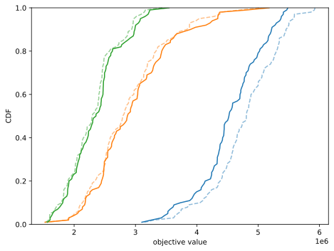
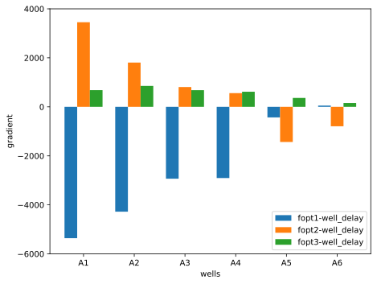
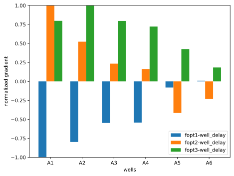
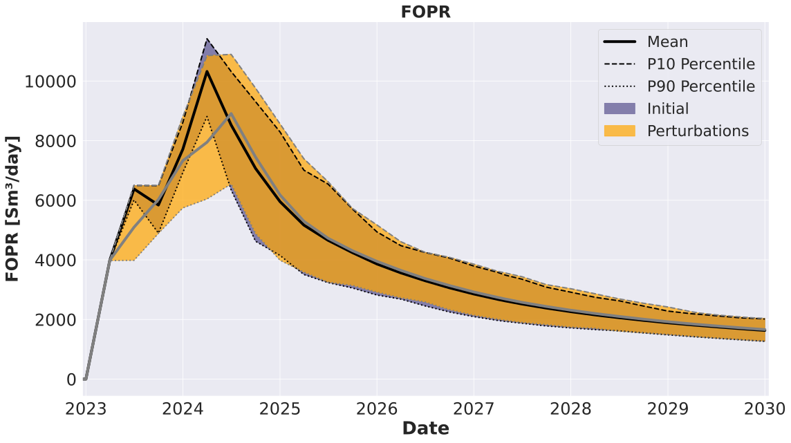
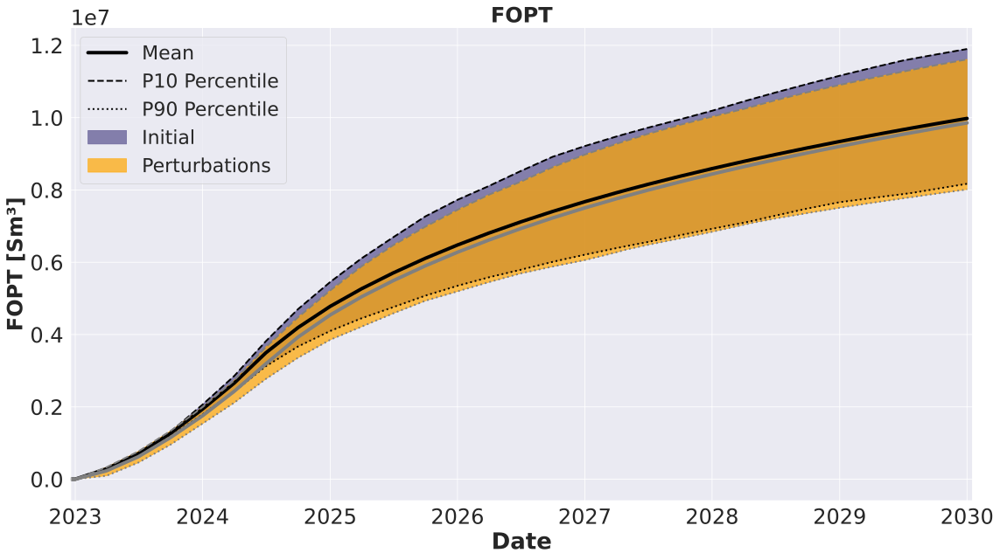

###################################
Drilling Delay Sensitivity Analysis
###################################

In this section we introduce the reader to preparing, launching and analyzing results of a sensitivity analysis experiment in order to quantify the impact of drilling delays in the field production life-cycle. Understanding the influence of this kind of operational uncertainty becomes particularly challenging when the sensitivities to such delays are to be determined in the presence of other uncertainties (e.g., geological uncertainties). EVEREST's stochastic gradient mostly used for optimization purposes can provide a measure of sensitivity over an ensemble of geological realizations.

First, we describe the sensitivity analysis problem and we explain the configuration files. Next, we show how to launch the EVEREST experiment and then we analyze the results:

* :ref:`Define optimization problem <problem_cs>`

  * :ref:`Optimization variables (controls) <controls_cs>`
  * :ref:`Objective functions (objectives) <objectives_cs>`
  * :ref:`Simulation models <simulation_cs>`

* :ref:`Prepare configuration <configuration_wo>`

  * :ref:`Main configuration <config_main_cs>`
  * :ref:`Configuration of forward jobs <configs_forward_jobs_cs>`
  * :ref:`Simulation schedule template <schedule_cs>`

* :ref:`Run EVEREST and analyze results <results_cs>`

.. _problem_cs:

***********************************
Define sensitivity analysis problem
***********************************
We are interested in determining the influence of drilling delays on the performance of the field in terms of a certain quantity of interest over a certain set of geological scenarios and over a certain time period.

.. _controls_cs:

Uncertain control variables
###########################

Drilling delays
***************

This example is somewhat related to the drilling order optimization tutorial example, but here the drilling sequence is assumed to be fixed and the focus is moved to assessing the impact of shifting the well opening schedule in time.

We plan to drill 6 wells; 4 producers: A1, A2, A3, A4 and 2 injectors A5, A6. We choose the starting date for drilling to be 2022-09-03. We assume that the drilling rig continuously available without any interruptions. We also assume that it takes 120 days for each well to be drilled, completed and ready to operate. However, we account for the possibility of the drilling process to be delayed, causing the drilling schedule to drift away from the original plan. Because there is a single drilling rig available, the drilling delays accumulate over time.

In order to quantify the impact of the drilling delays, an uncertain delay variable is introduced to each well in the drilling sequence, and the set of delays is perturbed statistically to sample this type of operational uncertainty. The individual well delays are assumed to be independent from each other, but the accumulated delay causes the time-shift in well opening schedule to be connected to delays of current and previous wells in the drilling sequence.

See table :ref:`table_drilling_sequence` for the base case drilling dates (without delays) based on chosen starting date, drilling order and drilling times.

.. _table_drilling_sequence:
.. csv-table:: Table: Initial drilling schedule
   :widths: 20, 20, 20, 20, 20, 20, 20
   :align: center

   "Driling order","A1","A2","A3","A4","A5","A6"
   "Drilling duration (days)","120","120","120","120","120","120"
   "Well opening dates","2023-01-01","2023-05-02","2023-08-31","2023-12-30","2024-04-29","2024-08-28"

In order to generate samples of the uncertain well drilling delays, we introduce new variables in the ``controls`` section of the EVEREST configuration file. The EVEREST workflow will perturb the delays around the specified ``initial_guess`` based on a Gaussian distribution with standard deviation equal to the value entered in ``perturbation_magnitude`` and within the ``min`` and ``max`` bounds. The perturbed scenarios will be evaluated and the resulting objective functions will be used to estimate a stochastic gradient of those objectives with respect to the delay variables. We will analyze these gradients to understand the influence of the delays on the selected quantities of interest (i.e., the objective functions specified in EVEREST configuration file) and identify the most impactful wells in terms of delays.

.. _table_drilling_delays:
.. csv-table:: Table: Drilling delays
   :widths: 20, 20, 20, 20, 20, 20, 20
   :align: center

   "Wells","A1","A2","A3","A4","A5","A6"
   "Initial guess delay (days)","18","18","18","18","18","18"
   "Std. deviation delay (days)","36","36","36","36","36","36"
   "Minimum delay (days)","0","0","0","0","0","0"
   "Maximum delay (days)","90","90","90","90","90","90"

.. _objectives_cs:

Objective functions
###################

Short-, mid- and long-term oil production (FOPT)
************************************************

Three objective functions are utilized in this drilling delay sensitivity analysis tutorial. They refer to the oil production (FOPT) in three time-horizons: ``fopt1`` for oil production from 01-01-2023 until 01-01-2025, ``fopt2`` for oil production from 01-01-2025 until 01-01-2027, and ``fopt3`` for oil production from 01-01-2027 until 01-01-2030.

.. _simulation_cs:

Simulation models
#################

Drogon reservoir model
**********************

The Equinor Drogon model is a synthetic reservoir model designed for testing and demonstrating ensemble-based workflows, including uncertainty quantification and optimization in subsurface projects. It is publicly available on GitHub to facilitate reproducible research and training.

.. _drogon-figure-init-soil:
.. figure:: ../model_description/images/DROGON_INIT_SOIL.png
    :align: center
    :alt: model zones
    :figclass: align-center

    Drogon model: Average initial oil saturation across the ensemble.

The model contains four production wells (A1 to A4) and two water injection wells (A5 to A6). In this tutorial, the production and injection starts in September 2022 and is simulated until January 2030. The average oil saturation across the 100 geological realizations for September 2022 is shown in :ref:`drogon-figure-init-soil`. The production wells A1 to A4 are located within the oil-bearing zone, while the injection wells A5 and A6 are placed below oil-water contact.

.. _configuration_cs:

*********************
Prepare configuration
*********************

The downloaded material is already complete and ready to be launched, however it is still useful to understand how the defined problem was configured. Information related to initial guess, objective functions and the model needs to be specified in main EVEREST configuration file. After downloading tutorial files from :ref:`download_material` this file will be located at ``control_sensitivities/everest/model/controlsens_experiment.yml``.

.. _config_main_cs:

Main configuration
##################

The initial guess for EVEREST is located in the section ``controls`` in main configuration file. This is where we insert the initial delay values for each well:

.. literalinclude:: ../../../data/drogon/control_sensitivities/everest/model/controlsens_experiment.yml
   :language: yaml
   :lines: 19-43

.. note::
   In this particular example, the fixed drilling sequence has been defined through a series of disabled priority control variables using the option ``enabled: False``. These are the same priority controls used when optimizing the drilling order (see :doc:`drilling order optimization tutorial <../well_order/well_order>`), but here they are disabled, meaning that they will not be perturbed nor optimized. Alternatively, one can remove the priority controls altogether from the ``enabled: False`` and provide a user-defined ``well_order.json`` file to be used as input for the ``drill_planner`` forward job.

The size of the perturbations to be assigned to the well drilling delay variables can be defined as standard deviation input in the ``perturbation_magnitude`` entry of the ``controls`` section. We also need to choose number of perturbations for each geological realization, see keyword ``perturbation_num`` in ``optimization`` section:

.. literalinclude:: ../../../data/drogon/control_sensitivities/everest/model/controlsens_experiment.yml
   :language: yaml
   :lines: 19,36,50,52-53

.. note::
   In order to be able to generate the gradients required to analyzed sensitivities within the first batch of the EVEREST experiment, we need to ensure that option ``speculative: True`` of the ``optimization`` section is used. Moreover, because the reliability of the sensitivity analysis truly depends on the quality of the obtained gradients, for sensitivity analysis experiments it is highly recommended to set a high number of required successful realizations and perturbations with the ``min_realizations_success`` and ``min_pert_success`` options of the same ``optimization`` section.

The name of the objective functions can be defined in the ``objective_functions`` section. Here we assume the three objectives to have the same weight. EVEREST will require a file with the same names to be generated by one of the forward model jobs.

.. literalinclude:: ../../../data/drogon/control_sensitivities/everest/model/controlsens_experiment.yml
   :language: yaml
   :lines: 45-48

.. _configs_forward_jobs_cs:

Configuration of forward jobs
#############################

For every set of well drilling delays EVEREST needs to translate these delays into a well opening schedule, by inserting the appropriate keywords into simulation schedule file at the correct date. This is accomplished by a sequence of forward jobs, i.e.:

.. literalinclude:: ../../../data/drogon/control_sensitivities/everest/model/controlsens_experiment.yml
   :language: yaml
   :lines: 75-79

The ``drill_date_planner`` job will modify the ``drill_time`` values originally specified in the ``wells`` section of the EVEREST configuration file by adding the ``well_delay`` values sampled by EVEREST.

The ``drill_planner`` job will translate a set of priorities given by EVEREST into a drilling schedule. Based on the ``drill_time`` values including potential delays, each well will be assigned a date according to drilling order at which to insert a keyword template. The start date and rig availability needs to be specified in the input file to the drill planner, i.e. ``control_sensitivities/everest/input/drill_planner_config.yaml``:

.. literalinclude:: ../../../data/drogon/control_sensitivities/everest/input/drill_planner_config.yml
   :language: yaml

The ``add_templates`` job will assign a keyword template for each well. In case of drilling delay sensitivity analysis, this template contains simulator specific keyword to open the well:

.. literalinclude:: ../../../data/drogon/control_sensitivities/everest/input/welopen.jinja

where EVEREST will replace ``{{name}}`` with the name of the well. Finally the ``schmerge`` (schedule merge) forward job will take the input schedule template ``CONTROLSENS.SCH`` and insert the ``WELOPEN`` keyword for each well and the correct date. Then it will produce updated schedule file ``SCHEDULE_OPT.SCH`` which will be used by the reservoir simulator. The remaining two forward jobs:

.. literalinclude:: ../../../data/drogon/control_sensitivities/everest/model/controlsens_experiment.yml
   :language: yaml
   :lines: 80-86

are responsible for launching reservoir simulator and calculating objective functions. The ``fopt1``, ``fopt2`` and ``fopt3`` objectives are obtained using the ``extract_summary_data`` forward model, which essentially reads and filters data from the simulation summary output files (``DROGON.UNSMRY``) for the selected date range. For more detailed information and examples regarding the forward models please refer to the `EVEREST Documentation <https://everest.readthedocs.io/en/latest/forward_model_jobs.html>`_.

.. _schedule_cs:

Simulation schedule template
############################

Before the optimization, the schedule file for simulation needs to be adapted. For example, in case of drilling delay sensitivity analysis, EVEREST will insert ``WELOPEN`` keyword for the delayed wells. Therefore, if a different well opening schedule was defined in the schedule, it needs to be removed. At the same time, wells need to have specified well controls in the beginning of the schedule with keywords such as ``WCONPROD`` or ``WCONINJE`` but the delayed wells need to have ``SHUT`` status in those. See an example schedule template in downloaded material: ``control_sensitivities/simulator/CONTROLSENS.SCH``. The updated schedule file by EVEREST can be seen in the simulation output directory defined in main EVEREST configuration file:

.. literalinclude:: ../../../data/drogon/control_sensitivities/everest/model/controlsens_experiment.yml
   :language: yaml
   :lines: 6-7

Updated schedule files for two different perturbations can be open to see the differences.

.. _results_cs:

Run EVEREST and analyze results
#########################################

After downloading the tutorial files from :ref:`download_material` and the reservoir model realizations from :ref:`drogon_description` we need to point EVEREST to the downloaded model realizations by changing the line:

.. literalinclude:: ../../../data/drogon/control_sensitivities/everest/model/controlsens_experiment.yml
   :language: yaml
   :lines: 1,3

to the correct directory path. 

.. note::
   In addition, we might want to change the name of the cluster scheduler. If no cluster support is present, then we can change the line to run all simulations locally, i.e., change ``lsf`` to ``local`` in line:

   .. literalinclude:: ../../../data/drogon/control_sensitivities/everest/model/controlsens_experiment.yml
      :language: yaml
      :lines: 60-62
   
   See also `EVEREST documentation <https://everest.readthedocs.io/en/latest/config_reference.html#>`_.

To launch EVEREST, we can execute the following command in the directory with configuration file:

.. code-block:: bash

   everest run controlsens_experiment.yml

.. note::
   The string ``r{{configpath}}`` will be interpreted as a directory path to the configuration file and the string ``r{{realization}}`` will be interpreted as integer number of the geological realization.

.. note::
   For more information on command line interface of EVEREST type ``everest --help``

.. attention::
   Note that the experiment results may differ when launched on a different machine, Python version or random seed due to random perturbations.  

After the experiment is finished, we can take a look at the output directories defined in ``environment`` section of EVEREST configuration file:

.. literalinclude:: ../../../data/drogon/control_sensitivities/everest/model/controlsens_experiment.yml
   :language: yaml
   :lines: 6-8

In our case, we can find the sensitivity analysis experiment results in ``r{{configpath}}/../output/r{{case_name}}/optimization_output`` and the respective reservoir simulation output in ``r{{configpath}}/../output/r{{case_name}}/simulation_output``. The reservoir simulation results will be organized per batch and simulation index. Since we are performing sensitivity analysis only, there will be only one batch folder ``batch_0``. Since we have 100 realizations, the sub-directories which end with ``simulation_0`` to ``simulation_99`` represent the runs based on initial guess delay values and the remaining directories, i.e., ``simulation_100``, ``simulation_101``, ``simulation_102``, etc. correspond to the randomly perturbed well delays. The total number of simulations will therefore depend on the choice of number of perturbations in the main configuration file of EVEREST. In our case, we selected 1 perturbation for each geological realization, therefore, in total, we should have 200 simulation directories in ``batch_0``.  

.. note::
  Well delays in batch 0 correspond to the chosen ``initial_guess`` values for the delay variables. 

The :ref:`figure_objectives_cs` shows the CDF plots of the three objective functions for the ``initial_guess`` delays (light dashed lines) and the perturbed delays (darker solid lines). We observe a clear decrease in ``fopt1`` with the perturbed delays and a small increase ``fopt2`` and ``fopt3``, indicating that the delays have a negative impact mostly for the short-term oil production. We also notice that the impact of the geological uncertainties (quantifiable through the bandwidth of the CDFs) outweighs the effect of the drilling delay uncertainty considered (reflected in the shift of the CDF curves).

.. _figure_objectives_cs:

   Figure: Cumulative distribution function (CDF) plots for initial vs. perturbed delays: ``fopt1`` in blue, ``fopt2`` in orange and ``fopt3`` in green

The :ref:`figure_raw_gradients_cs` and :ref:`figure_normalized_gradients_cs` display the gradients of the three objective functions with respect to the well delays. We see a decreasing impact of delays on short- and mid-term oil production as we move through the producers in the drilling sequence, suggesting that the delay of the first producers are the most critical. The negative effect in the short-term is the opposite for the mid-term, pointing to the fact that a share of the production loss in the short-term (2023-2025) is actually shifted to the mid-term period (2025-2027). Moreover, we see that the delay of the injectors have hardly any impact on the short-term production, primarily explained by the fact that, with the larger perturbed delays, they end up being open after 01-01-2025. These results also confirm the observations made above with the CDF plots: delays impact negatively the short-term oil production ``fopt1`` and have actually a minor positive effect on the mid- and long-term oil production, ``fopt2`` and ``fopt3`` respectively.

.. _figure_raw_gradients_cs:

   Figure: Raw gradient of the three objective functions with respect to well drilling delays

.. _figure_normalized_gradients_cs:

   Figure: Normalized gradient of the three objective functions with respect to well drilling delays

In order to explain the observed impact in oil production, we can also compare production time profiles from the reservoir simulations for initial and perturbed drilling delays. These time-series plots (:ref:`figure_fopr_cs` and :ref:`figure_fopt_cs`) validate the analysis performed with the gradient and CDF plots.

.. _figure_fopr_cs:

   
   Figure: Field Oil Production Rate

.. _figure_fopt_cs:

   Figure: Field Oil Production Total

Similar analysis can be done for other simulated quantities and their respective time profiles to gain more understanding of the behavior of the reservoir production and the performance of the drilling sequence in the presence of drilling delays, and in combination with geological uncertainties.

The analysis of the stochastic gradients estimated by EVEREST provide a systematic framework for both qualitative and quantitative evaluation of the influence of control sensitivities.

This concludes the drilling delay sensitivity analysis tutorial. We encourage the reader to check other types of tutorials in the Topics section.