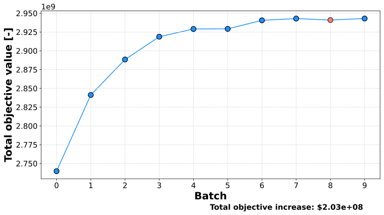
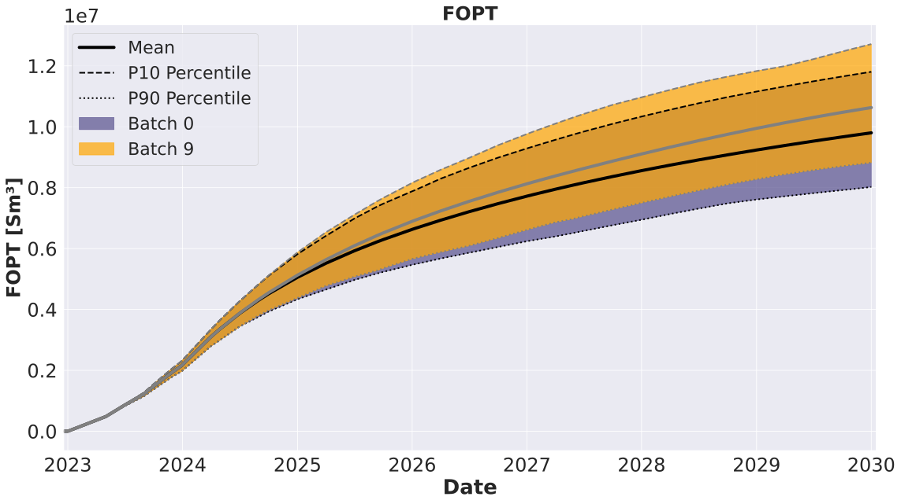
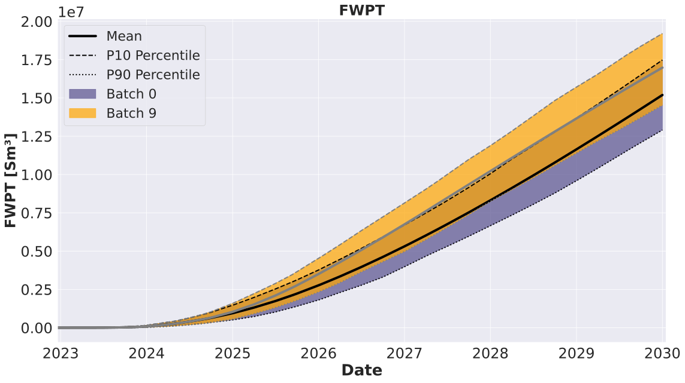
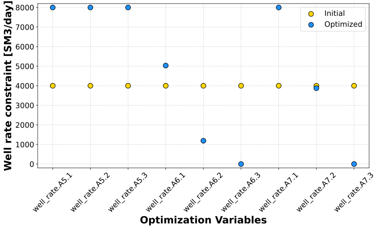
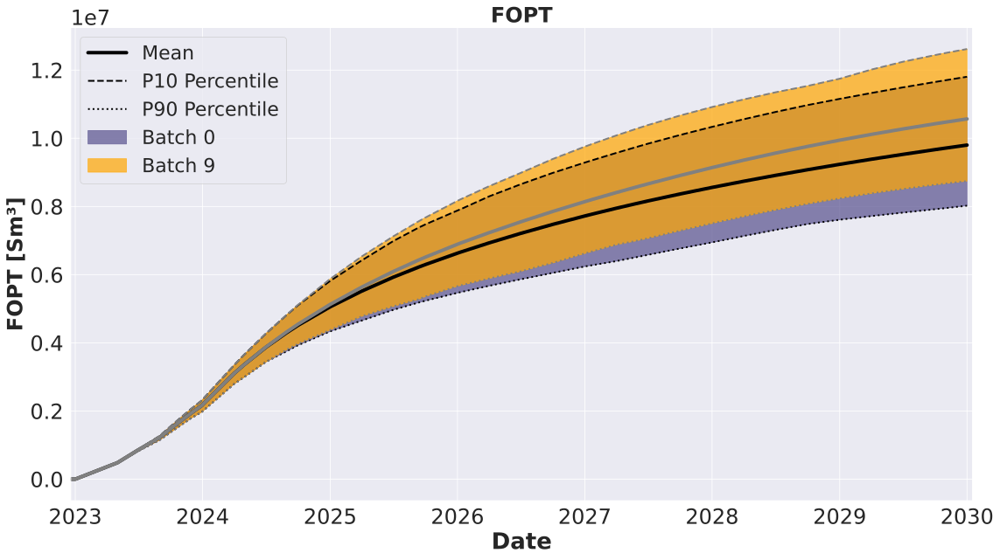
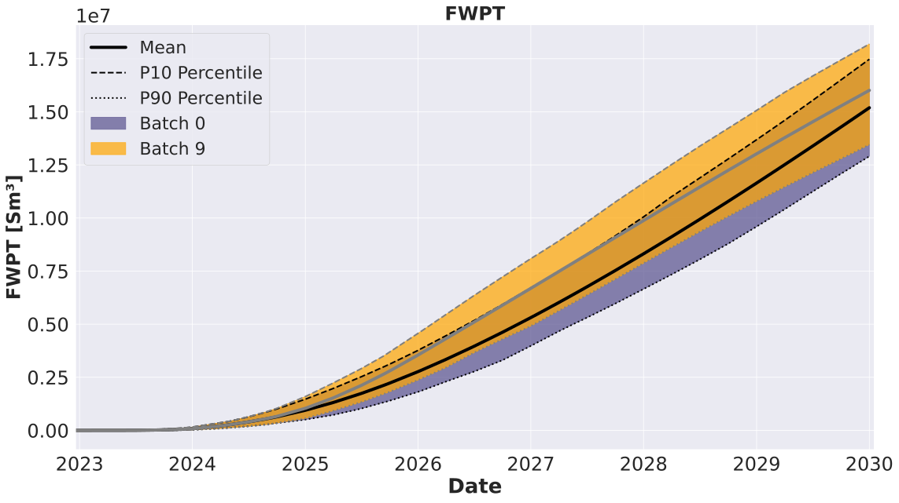
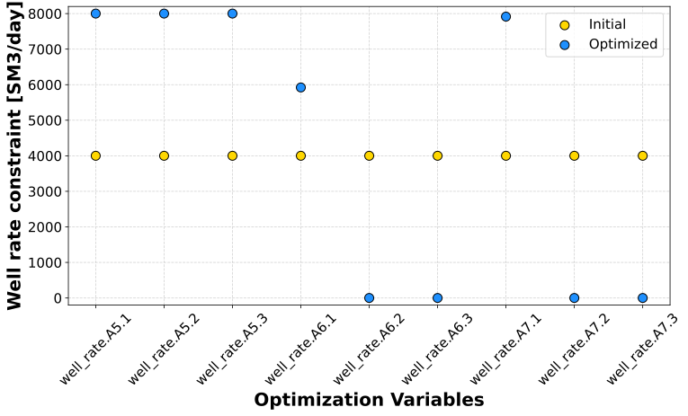

****************************
Multi-objective optimization
****************************

.. _well_rate_multi_objective:

Most real-world design and planning problems must also satisfy multiple objectives. Very often these objectives are in conflict with each other, which means that one objective must be decreased to increase the other objective. In such cases it is not trivial to find solutions which satisfy different objectives. When the problem includes two or more objectives, EVEREST employs the widely used weighted sum method to balance the objective functions. This approach aims to optimize a weighted objective function that combines multiple objectives in a single function according to:

.. math::

	J = w*J_{I} + (1-w)*J_{II}

where :math:`J_I` and :math:`J_{II}` are the two objective functions considered and :math:`w` is the weighting factor between both of objectives. Note that this can be extended to cases with more objectives by introducing more weights, which are recommended to be chosen as fraction values (i.e., 0 ≤ :math:`w` ≤ 1) adding up to 1.

Multi-objective optimization configuration file in EVEREST needs the following modification in comparison with the standard optimization configuration.

Objective function section
^^^^^^^^^^^^^^^^^^^^^^^^^^^

**The weight setting for each objective function:**
    Users can specify a higher weight for the preferred objective function. In the following example, we chose to prioritize maximizing NPV (Net Present Value) over minimizing FWPT (Field Water Production Total).

Following snippet shows the changes made to :code:`objective_functions` section of the config file for multi-objective optimization:

.. literalinclude:: ../../../data/drogon/multi_objective/everest/model/wellrate_multi_objective.yml
  :language: yaml
  :lines: 28-32

Forward model section
^^^^^^^^^^^^^^^^^^^^^^
The forward model for calculating objective function NPV and FWPT needs to be active.

.. literalinclude:: ../../../data/drogon/multi_objective/everest/model/wellrate_multi_objective.yml
  :language: yaml
  :lines: 60,68-69

After completing the optimization procedure, we can plot the results in a similar manner as in the previous experiments. The objective function (a weighted sum equation) is shown with iterations in the figure below. The weighted sum equation shown here is:

.. math::

   f(x) = w_1*npv(x) - w_2*fwpt(x)

where :math:`x` is the control vector containing the rates being optimized.

.. note::
    Note that there is multiplier of -1 defined for the FWPT objective function, this is because EVEREST by default maximizes while the FWPT is to be minimized.

.. note::

	All other steps of the setup (file save, syntax check and run) are similar to the previous experiments and can be followed :ref:`there <experiment_wr>`. The only difference is that there is one more injector considered, i.e., well A7. 

Experiment
^^^^^^^^^^

In this experiment, we will optimize well rate targets such that NPV of the field is maximized while simultaneously minimizing field water production.
The optimal results will highly depend on the weights selected from the users. For example, if the weight of NPV is much lower than the weight specified for FWPT, the optimal well rates would honor the rates at which the total water production are minimized (as shown in the experiment below). First we show results for the case with :math:`w_1 = 0.7` and :math:`w_2 = 0.3`.

.. _figure_objectives_wrm73:

    Figure: Objective function over the iterations

The :ref:`figure_objectives_wrm73` shows average total objective function at the
iterations of the optimization experiment. The increase in total objective function value of $2.03e+08 was achieved by changing
injection well rate targets over time from the initial guess. The increase in water production was approximately 12%.

    Figure: Cumulative oil production over time

    Figure: Cumulative water production over time

    Figure: Initial versus optimal controls

Presented below are the results from an experiment with increased weight for total field water production, i.e., for the case with :math:`w_1 = 0.3` and :math:`w_2 = 0.7`.

.. _figure_objectives_wrm2:

    Figure: Objective function over the iterations.

The :ref:`figure_objectives_wrm2` shows average total objective function at the iterations of the optimization experiment. The increase in total objective function value of $8.96e+07 was achieved by changing injection well rate targets over time from the initial guess. The increase in water production was approximately 5%, which is lower than in the previous case when with lower weight for FWPT objective.

    Figure: Cumulative oil production over time

    Figure: Cumulative water production over time

    Figure: Initial versus optimal controls