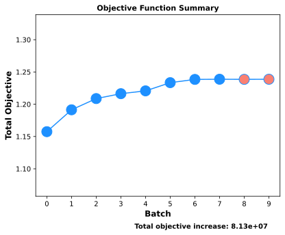
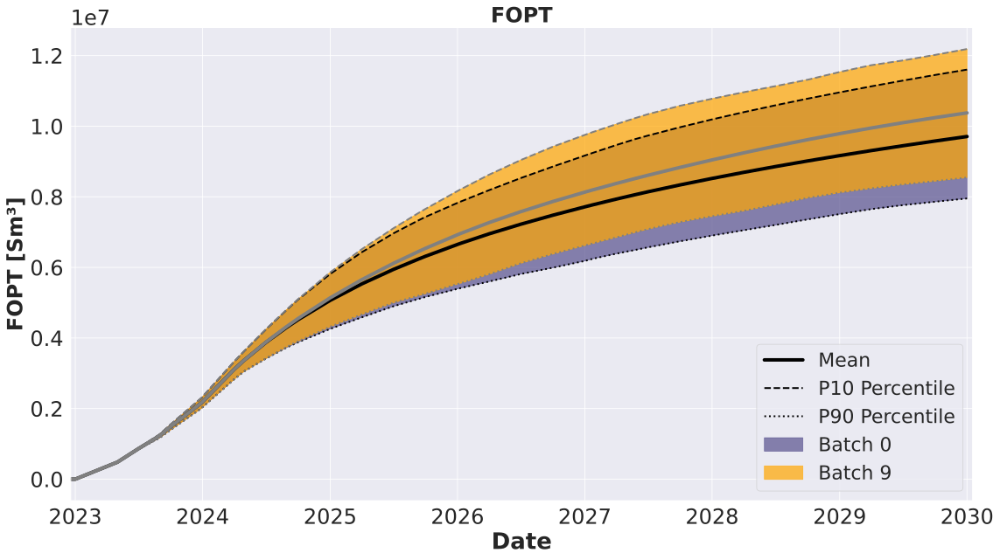
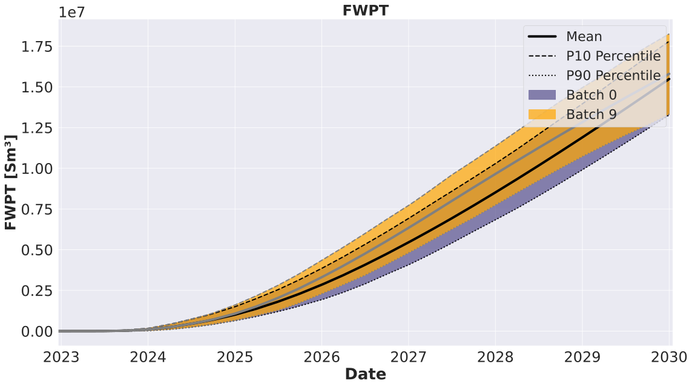
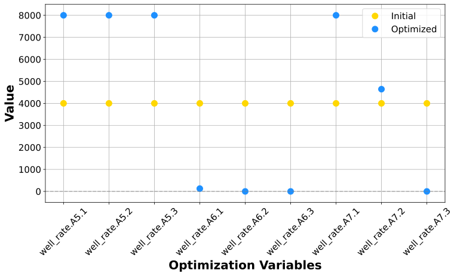
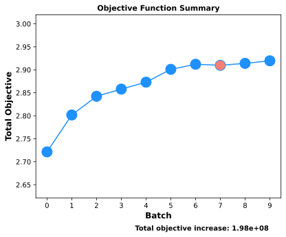
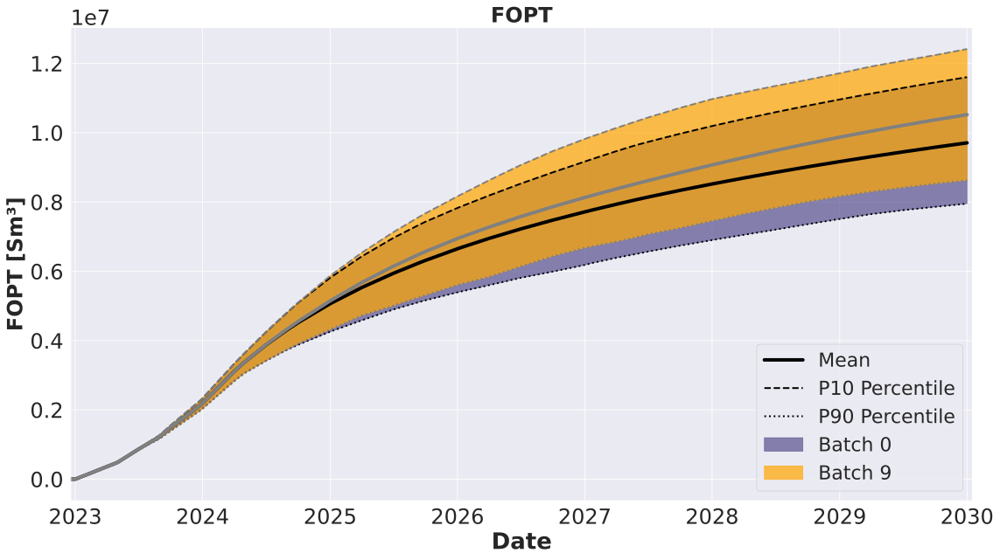
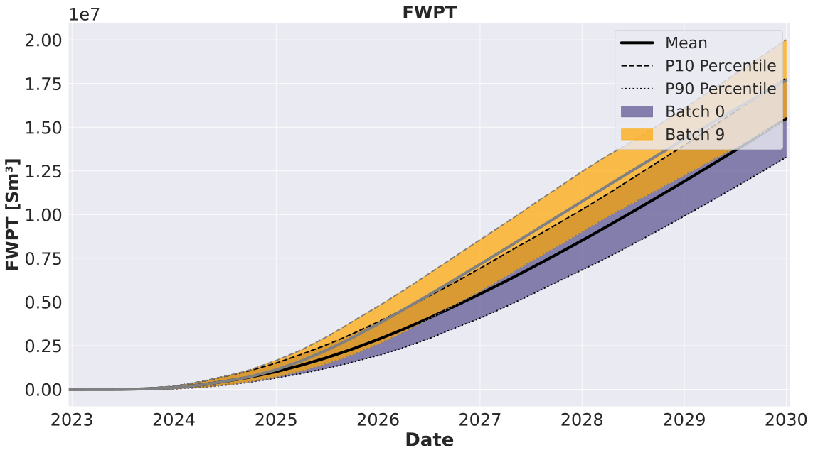
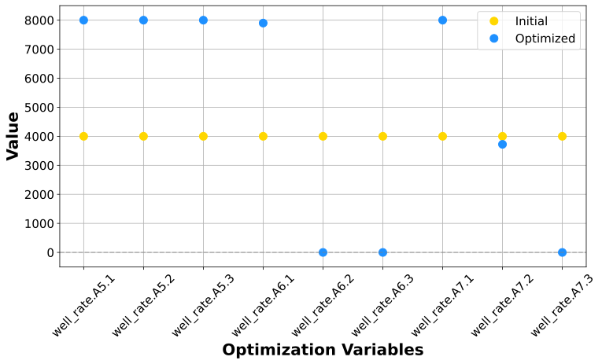

***********************************
Multi-objective optimization
***********************************

Most real-world design and planning problems must also satisfy multiple objectives. Very often these objectives are in conflict with each other, which means that one objective must be decreased to increase the other objective. In such cases it is not trivial to find solutions which satisfy different objectives. When the problem includes two or more objectives, EVEREST employs the widely used weighted sum method to balance the objective functions. This approach aims to optimize a weighted objective function that combines multiple objectives in a single function according to:

.. math::

	J = w*J_{I} + (1-w)*J_{II}

where :math:`J_I` and :math:`J_{II}` are the two objective functions considered and :math:`w` is the weighting factor between both of objectives. Note that this can be extended to cases with more objectives by introducing more weights, which are recommended to be chosen as fraction values (i.e., 0 ≤ :math:`w` ≤ 1) adding up to 1.

Multi-objective optimization configuration file in EVEREST needs the following modification in comparison with the standard optimization configuration.

Objective function section
^^^^^^^^^^^^^^^^^^^^^^^^^^^

**The weight setting for each objective function:**
    Users can specify a higher weight for the preferred objective function. In the following example, we chose to prioritize FWPT over NPV.

Following snippet shows the changes made to :code:`objective_functions` section of the config file for multi-objective optimization:

.. literalinclude:: ../data/drogon/well_rate/everest/model/wellrate_multi_objective.yml
  :language: yaml
  :lines: 28-32

Forward model section
^^^^^^^^^^^^^^^^^^^^^^
The forward model for calculating objective function NPV and FWPT needs to be active.

.. literalinclude:: ../data/drogon/well_rate/everest/model/wellrate_multi_objective.yml
  :language: yaml
  :lines: 59-65

After completing the optimization procedure, we can plot the results in a similar manner as in the previous experiments. The objective function (a weighted sum equation) is shown with iterations in the figure below. The weighted sum equation shown here is:

.. math::

   f(x) = w_1*npv(x) - w_2*fwpt(x)

where :math:`x` is the control vector containing the rates being optimized.

.. note::

	All other steps of the setup (file save, syntax check and run) are identical to the previous experiments and can be followed :ref:`there <experiment_wr>`.

Experiment
^^^^^^^^^^^^^^^^^^^^^^

In this experiment, we will alter well rates such that NPV of the field is maximized while simultaneously minimizing field water production.
The optimal results will highly depend on the weights selected from the users. For example, if the weight of NPV is much lower than the weight specified for FWPT, the optimal well rates would honor the rates at which the total water production are minimized (as shown in the experiment below).

    The best total objective (batch 7) yields an NPV of 4.16bn USD. The optimal well rate configuration provides an NPV improvement of 7% from an initial estimate of 3.89bn USD, while accounting for an only 2% increase in water production.

    Cumulative oil production over time

    Cumulative water production over time

    Initial versus optimal controls

Presented below are the results from an experiment where we chose to prioritize NPV over FWPT. As expected, the optimal injection rates is prescribed to maximize the oil production.

    The best total objective (batch 9) yields an NPV of 4.18bn USD. The optimal well rate configuration provides an NPV improvement of 7.5% from an initial estimate of 3.89bn USD, while accounting for an 14.2% increase in water production, in this case.

    Cumulative oil production over time

    Cumulative water production over time

    Initial versus optimal controls
