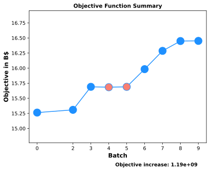
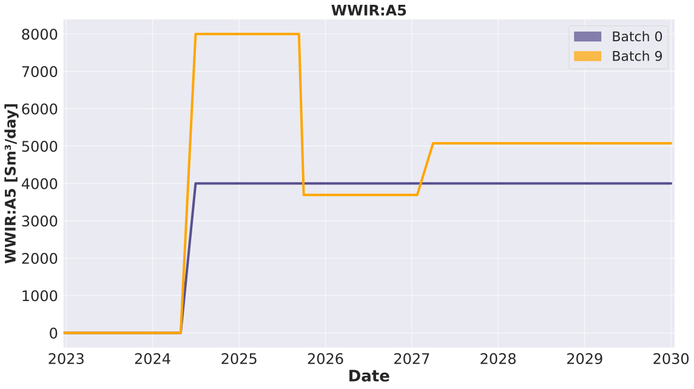
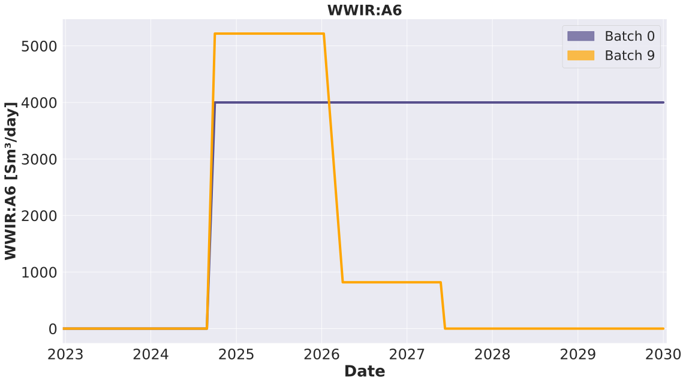
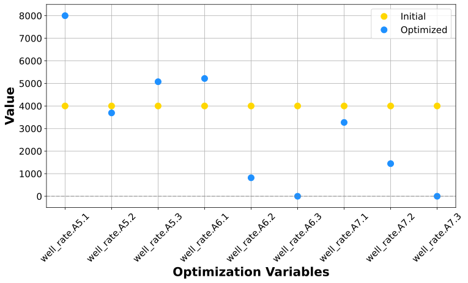

**********************
Well Rate Optimization
**********************

The primary goal of this tutorial is to illustrate the process of optimizing production and injection rates of individual wells. The optimization maximizes a user-chosen, predefined objective function. The tutorial consists of three sections:

1. :ref:`The setup of well rate optimization <setup_wr>`
2. :ref:`Special considerations <howto_wr>`
3. :ref:`Practical experiment <experiment_wr>`

Model Description
#################

The Drogon field is a new Equinor benchmark model, used for testing different algorithms and software.

.. figure:: ../model_description/images/DROGON_INIT_SOIL.png
    :width: 1689px
    :height: 1047px
    :align: center
    :scale: 40
    :alt: model soil wells
    :figclass: align-center

    The oil saturation map of one of the Drogon field realizations showing the location of the existing well targets and faults.

A detailed description of the Drogon reservoir model can be found :ref:`here <drogon_description>`.

Objective Function
##################

The well injection rate optimization experiment uses a single objective function. The chosen objective is an economic metric known as the net present value (NPV). The NPV serves as the quantifiable criterion for measuring the improvement in profitability and evaluating the performance of the optimization process. Its specific definition is as follows:

.. math::

     J = \sum\limits_{k=1}^{K}\Bigg(\dfrac{\{[(q_{o,k}) \cdot r_{o} - (q_{wp,k}) \cdot r_{wp}] - [(q_{wi,k}) \cdot r_{wi}]\} \cdot \Delta t_{k}}{(1+b)^{\frac{t_{k}}{\tau_{t}}}}\Bigg),

where :math:`q_{o,k}` is the oil production rate in :math:`\frac{m^3}{day}`, :math:`q_{wp,k}` is the water production rate in :math:`\frac{m^3}{day}`, :math:`q_{wi,k}` is the water injection rate in :math:`\frac{m^3}{day}`, :math:`r_o` is the price of oil in :math:`\frac{$}{m^3}`, :math:`r_{wp}` is the cost of water produced in :math:`\frac{$}{m^3}`, :math:`r_{wi}` is the cost of water injected in :math:`\frac{$}{m^3}`, :math:`{\Delta}t_k` is the difference between consecutive time steps in days, :math:`b` is the discount factor expressed as a fraction per year, :math:`t_k` is the cumulative time in days corresponding to time step :math:`k`, and :math:`{\tau}_t` is the reference time period for discounting, typically one year (365.24 days).

.. note::

   Any additional costs such as CAPEX or OPEX or specific well related costs can be added to the equation above.

The unit prices for oil production (:math:`r_o`), water production (:math:`r_{wp}`) and water injection (:math:`r_{wi}`) are defined in the :file:`price.yml` file, which can be found and edited at the following location:

.. code-block:: console

  $ cd everest/input/files/

.. admonition:: Edit the file using the `gedit` editor (or any other editor, e.g., `vscode`)

  .. code-block:: console

    $ gedit prices.yml

.. _setup_wr:

The setup of well rate controls
###############################
An injection or production strategy for a well or collection of wells is defined by two main components, namely the amplitude (the value of the rate prescribed) and the duration for which the value is prescribed. The current standard forward model job available in EVEREST (called **well_constraints**) allows for the rates, time intervals and injection phases to be perturbed. A user can define multiple time intervals to be varied by the procedure. Thus for each time interval a duration, rate and phase control variable can be defined. This tutorial presents only how to define control variables asssociated with injection rates. 

This section demonstrates the necessary inputs for setting up a well rate optimization case. The configuration file :file:`wellrate_experiment.yml` is built in such a way that it can be adapted to implement different well rate optimization experiments.

.. admonition:: Open a unix command window and type the following line

  .. code-block:: console

     $ cd everest/model

  .. code-block:: console

     $ gedit wellrate_experiment.yml

The control vector for `wellrate_experiment.yml` contains water injection rates for the wells **[A5, A6, A7]** over three time intervals. Moreover, a hundred different realizations have been used to capture the uncertainty in the reservoir model.

The most relevant parts of the configuration file for this set of experiments are the ``controls`` and the ``forward model`` sections, which are described below.

Controls
********
The following parameters describing the control variables should be defined in the ``controls`` section of the configuration file:

* **Name** of the controls (user-defined, in this tutorial “well_rate” )
* **Lower and upper bounds** for the control variable in unscaled values
* **Perturbation magnitude for gradient approximation.** This parameter affects the degree of statistical perturbations applied to a set of controls to estimate the sensitivity around the current solution. These perturbations are used to compute the stochastic gradient passed to the optimizer.
* **Initial values** of the controls (e.g., initial_guess). These controls are unscaled in the range of lower and upper bounds defined above.

The following snippet illustrates the ``controls`` section of the configuration file for three wells over three time intervals.

.. note::

	In order to define an action on a specific well at different times, EVEREST requires that a control variable is defined for that specific target and timestamp. This is achieved by prescribing a unique combination of target **name** and time **index**. In the code snippet below, three well actions are defined for each of the injectors at three different timestamps.

.. literalinclude:: ../../../data/drogon/well_rate/everest/model/wellrate_experiment.yml
  :language: yaml
  :lines: 11-26

.. important::

	These time indexes have to be specified in the :file:`input/files/rate_constraints.yml` file, in the format of one entry per time index per well.

.. literalinclude:: ../../../data/drogon/well_rate/everest/input/rates_constraints.yml
  :language: yaml

The index key in the control definition is used in conjunction with a template file explained below to determine the time interval for which the control value is applicable. Therefore, a case with a single control time interval would be defined with a single index key value while a case with multiple time intervals will need multiple index key values. The number of index keys can be different for the different wells which means the number of control variables per well and the control time intervals can be different for different wells.

.. note::

	It is recommended to start with a configuration with relatively few control variables to evaluate and quality check the setup. More control variables can be added at a later stage, which in general will add complexity but also flexibility in order to obtain an optimized strategy. The optimal/robust setup w.r.t. control variables is typically case dependent and should be evaluated by the individual EVEREST users.

.. _wr_forward_model:

Forward Models
**************

The ``forward_model`` section contains the list of jobs that will manipulate the SCHEDULE files required for the simulations. The setup of the forward models for the well rate optimization experiments is presented below:

.. literalinclude:: ../../../data/drogon/well_rate/everest/model/wellrate_experiment.yml
  :language: yaml
  :lines: 56-61
  
The **well_constraints** job requires two input files in their respective formats to be defined by a user. These are:

1. :file:`-i  wells_readydate.json`
	This file is used to define the start of prescribing the first target rate for each well. This information is used to calculate the dates which correspond to the time intervals in the prediction phase as defined by the user.

2. :file:`-c  rates_constraints.yml`
	This file contains information about the duration and phase keys are used to define the production/injection phase of each well and the length of the control time duration.

In addition to these two user-defined input files required by this forward model job, an additional file specified using **-rc** :file:`well_rate.json` is provided as input. :file:`well_rate.json` is automatically generated by EVEREST and is named according to the value given in the key **name** in the ``controls`` section. Finally, the output file of the **well_constraints** forward model, specified using **-o** :file:`wells_rate.yml`, can also be user-defined and serves as input to the next job in the sequence of forward models.

The **add_templates** job requires one user-defined input file and a second input file which is the output from the previous **well_constraints** forward model job. The user-defined input file is:

1. :file:`-c  template_config.yml`,
	This file provides information about the templates (simulator specific keywords) to be used by EVEREST when parsing the output from **well_constraints** to a file with information that a simulator can process. The templates are user-defined and can be linked using a configurable mapping system.

The final job in this sequence of forward models is the **schmerge** job which processes the information of the previous two jobs (for example target rate and date) and writes an updated schedule file with all relevant information ready for simulation.

.. important::

	For more detailed information and examples regarding the forward models please refer to the detailed `forward model documentation <https://everest.readthedocs.io/en/latest/forward_model_jobs.html>`_.
  
.. _howto_wr:

Special considerations
######################

The following section contains recommendations regarding certain settings that may be case dependent and that can influence the performance of the gradient-based iterative procedure.

The estimated gradient is based upon the delta between the perturbed controls and the current controls versus the delta of the corresponding objective functions. EVEREST ensures that both the controls and the objectives are in the same order of magnitude, since the relative scale has an impact on the gradient calculation.

.. literalinclude:: ../../../data/drogon/well_rate/everest/model/wellrate_experiment.yml
  :language: yaml
  :lines: 11-29

As presented in the **controls** section above, it is preferable to start from a control strategy which doesn't have all controls set on the boundaries (min or max). This choice should always be coupled with the perturbation magnitude.

Moreover, irrespective of the gradient quality, the algorithm used for optimization can impact search performance depending on the case and the type of control being used as variable.

.. important::

	For more detailed information regarding the available algorithms please refer to the detailed `optimization backend documentation <https://everest.readthedocs.io/en/latest/optimization_algorithms.html>`_.

.. _experiment_wr:

Well Rate Optimization Experiment
##################################

The following experiment shows how to run EVEREST for well rate optimization with a given configuration file. The optimization iterates on different well rate strategies to improve an objective function, which in this case is the NPV.

.. note::

	For the following experiment, do not forget to provide the right **simulation_folder** you want to use.

.. note::

	The optimization results were generated using the EVEREST **version 14.2.3**. Expect small differences in results when using different EVEREST distributions.

Experiment setup
*****************
In this experiment, we will alter the flow rates for different injection wells during a period of 7 years (from 2023 to 2030) to maximize an economic objective function, i.e., NPV. The control rates are defined three times in the 7-year simulated period every 500 days. Therefore, with three wells (we only vary the rates of the three injectors while keeping the controls of the producers fixed) and three control time intervals, we have a total of 3x3=9 control variables to be optimized. In this experiment uncertainty is taken into account by  using an ensemble of a 100 equally-plausible reservoir models and maximizing average NPV.

The EVEREST configuration file for this experiment is :file:`wellrate_experiment.yml`.

To run the first experiment navigate to :file:`everest/model` and follow the procedure below to first edit and validate the configuration file and then run the experiment.

.. admonition:: Navigate to the folder containing the configuration file

  .. code-block:: console

      $ cd everest/model

.. admonition:: See and change the configuration file with your favorite editor (here `gedit`)

  .. code-block:: console

      $ gedit wellrate_experiment.yml

.. admonition:: Run lint test to ensure the syntax of the configuration file is valid

  .. code-block:: console

      $ everest lint wellrate_experiment.yml

If the configuration file is valid, you can now run the optimization experiment as follows:

.. admonition:: Run EVEREST in a unix terminal

  .. code-block:: console

      $ everest run wellrate_experiment.yml

The results of the optimization process can be found in the following location:

.. admonition:: Go to

  .. code-block:: console

      $ cd everest/output/WELLRATE_EXP/optimization_output/

This folder contains the optimization results in the form of **.parquet** files aggregated by batch (:file:`optimization_output/ensembles`), or by experiment (:file:`optimization_output/optimizer`). These files can be processed in the same way as **.csv** files. The objective function evolution graph and the control variables plot presented below are generated based on these files.
Additionally, the direct output from the optimizer is also located here, :file:`optimization_output/dakota`.

Analysis
********

The Everviz application can be used to load the optimization results and plot the objective function values. The figure show that an increase in the objective, i.e., the expected NPV over the entire ensemble, has been achieved.

    The initial NPV is 15.26bn USD while the best NPV (batch 9) yields an NPV of 16.45bn USD. The optimal well rate configuration provides an NPV improvement of 8% or 1.19bn USD 

.. admonition:: Optimization results can be visualized using the built in solution, Everviz

  .. code-block:: console

      $ everest results wellrate_experiment.yml

.. important::

	For more detailed information regarding the Everviz usage please refer to the detailed :ref:`documentation <everviz>`.

To quantify and comprehend the flow mechanisms that led to the observed increase in the objective function value, a comparison of the initial and optimal injection strategies is provided in the figures below. The field oil production and water injection rates, as well as the cumulative production and injection rates, are compared between the initial case (represented in purple) and the optimized case (represented in orange) for all model realizations. These results correspond to ''**batch 0**'' (initial case) and ''**batch 9**'' (optimized case) from the simulation output.

From the rate figures below we see that that in the first few years the optimized case enables a higher oil production rate and allocates a higher injection rate to maintain reservoir pressure. The following oil production/water injection cumulative plots show that the optimized drainage strategy results in a higher NPV due to higher total oil production.

.. note::

	It is also possible to plot different keywords for the realizations which have highest and lowest NPV value before and after optimization.

    Cumulative oil production over time

    Cumulative water injection over time

    Field pressure development over time

Below is the comparison between initial case (purple) and optimized case (orange) for the water injection rates of the individual wells.

    Water injection rates for well A5

    Water injection rates for well A6

    Water injection rates for well A7

The figure below compares the initial and optimal values for the controls. The figure shows the need for more injection in the first period of production. A more refined strategy can be obtained by having more time intervals, i.e., introducing additional control variables within the production time frame.

    Initial versus optimal controls

.. important::

	For more examples on how to add complexity to the setups please refer to the :ref:`multi-objective <well_rate_multi_objective>` and constrained optimization topics.
