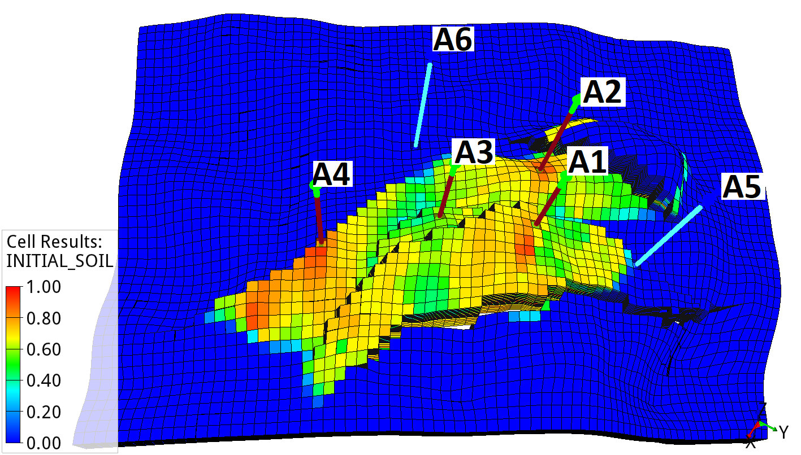
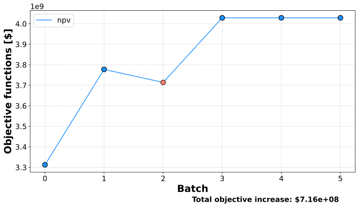
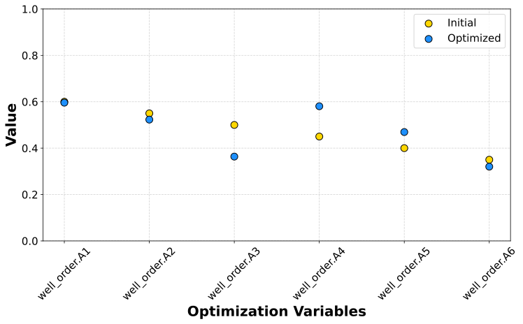
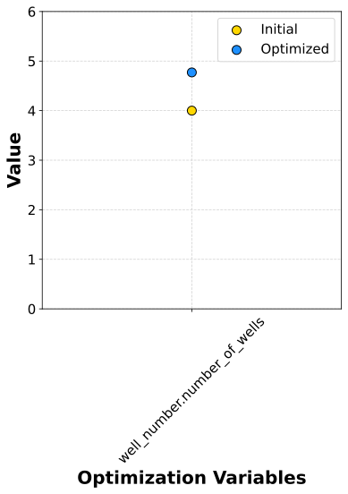
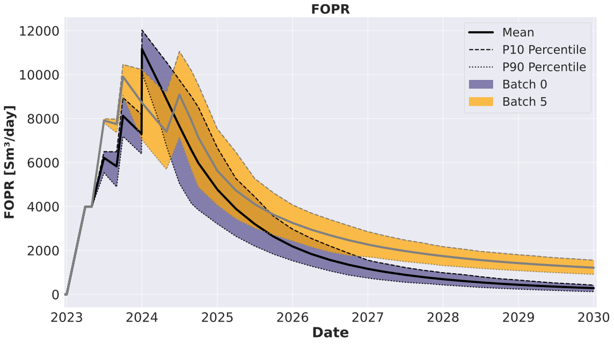
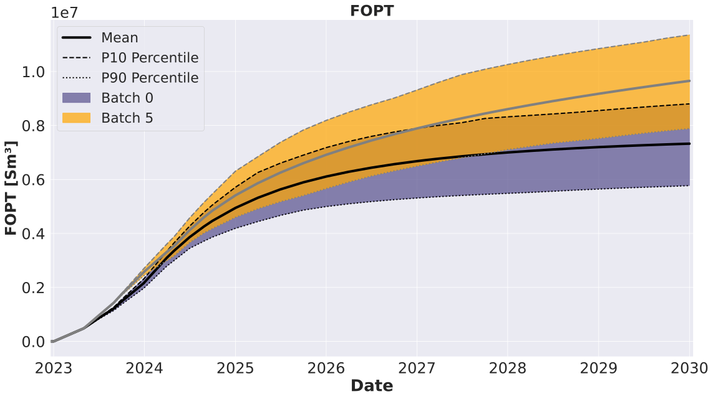
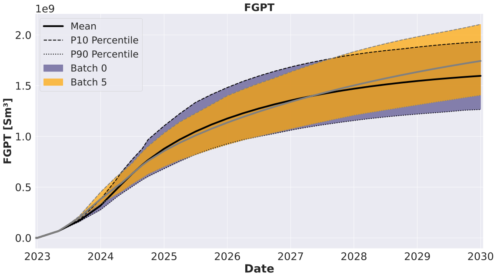
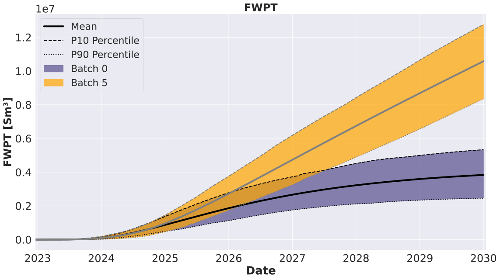
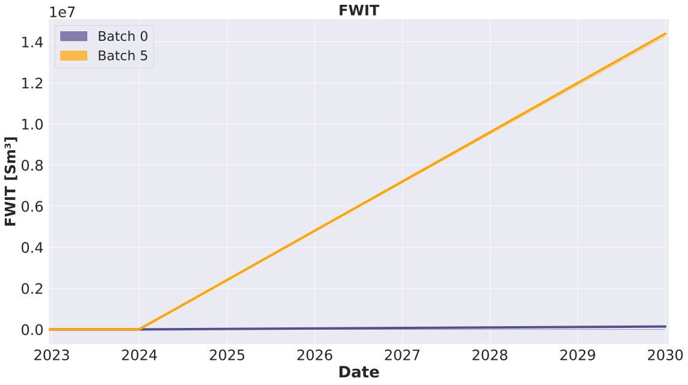

###########################
Well Selection Optimization
###########################

In this section we introduce the reader to preparing, launching and analyzing results of well selection optimization where we select a subset of wells from a set of several planned candidate wells. First, we formulate an example optimization problem and we explain the configuration files. Next, we show how to launch an optimization experiment and then we analyze the results:

* :ref:`Define optimization problem <problem_ws>`

  * :ref:`Optimization variables (controls) <controls_ws>`
  * :ref:`Objective functions (objectives) <objectives_ws>`
  * :ref:`Simulation models <simulation_ws>`

* :ref:`Prepare configuration <configuration_ws>`

  * :ref:`Main configuration <config_main_ws>`
  * :ref:`Configuration of forward jobs <configs_forward_jobs_ws>`
  * :ref:`Simulation schedule template <schedule_ws>`

* :ref:`Run EVEREST and analyze results <results_ws>`

.. _problem_ws:

***************************
Define optimization problem
***************************
We are interested in finding drilling sequence of several wells that maximizes a certain objective function over a certain set of geological scenarios and over a certain time period.

.. _controls_ws:

Optimization variables
######################

Drilling priority values
************************

Let's assume that we plan to select up to 5 wells out of 6 candidates and find the best drilling order; 4 producers: A1, A2, A3, A4 and 2 injectors A5, A6. We choose the starting date for drilling to be 2022-09-03. We assume that the drilling rig continuously available without any interruptions. We also assume that it takes 120 days for each well to be drilled, completed and ready to operate. This means that the dates at which wells will be opened in the model are fixed and we only select the wells to be drilled and their order. See the :ref:`table_initial_controls_ws` for resulting drilling dates based on chosen starting date and drilling times. For information on how to define a more complex time scheduling constraints with rig and slot availability, see relevant documentation section (`Everest documentation <https://everest.readthedocs.io/en/latest/forward_model_jobs.html#drill_planner-category>`_).

.. _table_initial_controls_ws:
.. csv-table:: Table: Initial priority values
   :widths: 20, 20, 20, 20, 20, 20, 20
   :align: center

   "Dates","2023-01-01","2023-05-02","2023-08-31","2023-12-30","2024-04-29","2024-08-28"
   "Wells","A1","A2","A3","A4","A5","A6"
   "Priorities","0.6","0.55","0.5","0.45","0.4","0.35"

Let's assume, we want to start optimization with the first 4 wells selected based on alphabetical order of their names. We need to assign drilling priority value for each well. The higher the priority value the more likely the well will be selected. This means, we need to choose the highest priority value for the first well (A1) and lowest priority for the last well (A6). See the :ref:`table_initial_controls_ws` for chosen well priority values. We recommend spacing priority values evenly. We also need to specify what standard deviation to use when randomizing priorities for perturbations. We recommend setting standard deviation to be equal to difference between the priority values (0.05 for the example in :ref:`table_initial_controls_ws`). In addition, we will need another control variable to specify the number of wells selected. In our case, we will start with the first 4 wells and we will also specify that we are searching for optimal number of wells between 1 and 5. It is also possible to specified fixed number of wells to be selected, see relevant documentation section (`Everest documentation <https://everest.readthedocs.io/en/latest/forward_model_jobs.html#select_wells-category>`_).

.. note::
   This tutorial extends on the well order tutorial where priority values were used to define drilling order of the wells. Here, meaning of the priority is similar, i.e. the higher the priority value for the well is, the earlier the well will be drillied. However, in addition, the more likely that well will be selected. The number of wells variable acts as a cut-off for the number of wells selected with the highest priorities. 

.. _objectives_ws:

Objective functions
###################

Net present value (NPV)
***********************

A single objective function is utilized in this well trajectory optimization tutorial. The economic objective function is defined as Net Present Value (NPV) as follows:

.. math::

     J = \sum\limits_{k=1}^{K}\Bigg(\dfrac{\{[(q_{o,k}) \cdot r_{o} + (q_{g,k}) \cdot r_{g} - (q_{wp,k}) \cdot r_{wp}] - [(q_{wi,k}) \cdot r_{wi}]\} \cdot \Delta t_{k} - c_{k}}{(1+b)^{\frac{t_{k}}{\tau_{t}}}}\Bigg)

Where :math:`q_{o,k}` is the oil production rate in :math:`\frac{Sm^3}{day}`, :math:`q_{g,k}` is the gas production rate in :math:`\frac{Sm^3}{day}`, :math:`q_{wp,k}` is the water production rate in :math:`\frac{Sm^3}{day}`, :math:`q_{wi,k}` is the water injection rate in :math:`\frac{Sm^3}{day}`, :math:`r_o` is the price of oil in :math:`\frac{$}{Sm^3}`, :math:`r_{wp}` is the cost of water produced in :math:`\frac{$}{Sm^3}`, :math:`r_{wi}` is the cost of water injected in :math:`\frac{$}{Sm^3}`, :math:`{\Delta}t_k` is the difference between consecutive time steps in days, :math:`c_k` are the CAPEX costs, :math:`b` is the discount factor expressed as a fraction per year, :math:`t_k` is the cumulative time in days corresponding to time step :math:`k`, and :math:`{\tau}_t` is the reference time period for discounting, typically one year (365.24 days). The unit prices for oil production (:math:`r_o`), gas production (:math:`r_g`), water production (:math:`r_{wp}`), and water injection (:math:`r_{wi}`) as well as drilling costs can be defined in :file:`well_selection/everest/input/prices.yml`.

.. _simulation_ws:

Simulation models
#################

Drogon Reservoir Model
**********************

The Equinor Drogon model is a synthetic reservoir model designed for testing and demonstrating ensemble-based workflows, including uncertainty quantification and optimization in subsurface projects. It is publicly available on GitHub to facilitate reproducible research and training.

.. _drogon-figure-init-soil-ws:

    Drogon model: Average initial oil saturation across the ensemble.

The model contains four production wells (A1 to A4) and two water injection wells (A5 to A6). In this tutorial, the production and injection starts in September 2022 and is simulated until January 2030. The average oil saturation across the 100 geological realizations for September 2022 is shown in :ref:`drogon-figure-init-soil-ws`. The production wells A1 to A4 are located within the oil-bearing zone, while the injection wells A5 and A6 are placed below oil-water contact.

.. _configuration_ws:

*********************
Prepare configuration
*********************

The downloaded material is already complete and ready to be launched, however it is still useful to understand how the defined problem was configured. Information related to initial guess, objective functions and the model needs to be specified in main EVEREST configuration file. After downloading tutorial files from :ref:`download_material` this file will be located at ``well_selection/everest/model/wellselection_experiment.yml``.

.. _config_main_ws:

Main configuration
##################

The initial guess for EVEREST is located in the section ``controls`` in main configuration file. This is where we insert the initial priority values for each well and control variable for specifying initial number of wells selected:

.. literalinclude:: ../../../data/drogon/well_selection/everest/model/wellselection_experiment.yml
   :language: yaml
   :lines: 19-39

At every iteration EVEREST will randomly perturb current best priority values and number of wells selected and use this information to calculate the direction and step size to propose improved values (and therefore improved well selection) for the next iteration. This means that we need to choose the size of the perturbation, see standard deviation input as ``perturbation_magnitude`` in the ``controls`` section. We also need to choose number of perturbations for each geological realization, see keyword ``perturbation_num`` in ``optimization`` section:

.. literalinclude:: ../../../data/drogon/well_selection/everest/model/wellselection_experiment.yml
   :language: yaml
   :lines: 44,47

We also need to specify the name of the objective function in the ``objective_functions`` section. EVEREST will require file of the same name generated by one of the forward model jobs.

.. literalinclude:: ../../../data/drogon/well_selection/everest/model/wellselection_experiment.yml
   :language: yaml
   :lines: 41-42

.. _configs_forward_jobs_ws:

Configuration of forward jobs
#############################

For every set of priorities EVEREST needs to translate these priorities into drilling schedule. Then select the wells to be drilled. And finally, it will insert selected keyword template responsible for opening the well into simulation schedule file at the correct date. This is accomplished by a sequence of forward jobs, i.e.:

.. literalinclude:: ../../../data/drogon/well_selection/everest/model/wellselection_experiment.yml
   :language: yaml
   :lines: 69-78

The ``drill_planner`` job will translate a set of priorities given by EVEREST into a drilling schedule, i.e. each well will be assigned a date according to drilling order at which to insert a keyword template. The start date and rig availability needs to be specified in the input file to the drill planner, i.e. ``well_selection/everest/input/drill_planner_config.yaml``:

.. literalinclude:: ../../../data/drogon/well_selection/everest/input/drill_planner_config.yml
   :language: yaml

The ``select_wells`` job will select a subset of wells to be drilled from the set of all wells based on the control variable ``well_number``.

The ``add_templates`` job will assign a keyword template for each well. In case of drilling order optimization this template contains simulator specific keyword to open the well:

.. literalinclude:: ../../../data/drogon/well_selection/everest/input/welopen.jinja

where EVEREST will replace ``{{name}}`` with the name of the well. Finally the ``schmerge`` (schedule merge) forward job will take the input schedule template ``WELLSELECT.SCH`` and insert the ``WELOPEN`` keyword for each selected well and the correct date. Then it will produce updated schedule file ``SCHEDULE_OPT.SCH`` which will be used by the reservoir simulator. The remaining two forward jobs:

.. literalinclude:: ../../../data/drogon/well_selection/everest/model/wellselection_experiment.yml
   :language: yaml
   :lines: 74-78

are responsible for launching reservoir simulator and calculating NPV. The NPV input file ``well_selection/everest/input/prices.yml`` contains economic input parameters such as unit prices for oil production, water production and injection, drilling costs, discount factor, etc. For more detailed information and examples regarding the forward models please refer to the `EVEREST Documentation <https://everest.readthedocs.io/en/latest/forward_model_jobs.html>`_.

.. _schedule_ws:

Simulation schedule template
############################

Before the optimization, the schedule file for simulation needs to be adapted. For example, in case of optimization of drilling order or well selection, EVEREST will insert ``WELOPEN`` keyword for optimized wells. Therefore, if a different well order was defined in the schedule it needs to be removed. At the same time, wells need to have specified well controls in the beginning of the schedule with keywords such as ``WCONPROD`` or ``WCONINJE`` but the optimized wells need to have there ``SHUT`` status. See an example schedule template in downloaded material: ``well_selection/simulator/wELLSELECT.SCH``. The updated schedule file by EVEREST can be seen in the simulation output directory defined in main EVEREST configuration file:

.. literalinclude:: ../../../data/drogon/well_selection/everest/model/wellselection_experiment.yml
   :language: yaml
   :lines: 6-7

Updated schedule files for two different perturbations can be open to see the differences.

.. _results_ws:

Run EVEREST and analyze results
###############################

After downloading the tutorial files from :ref:`download_material` and the reservoir model realizations from :ref:`drogon_description` we need to point EVEREST to the downloaded model realizations by changing the line:

.. literalinclude:: ../../../data/drogon/well_selection/everest/model/wellselection_experiment.yml
   :language: yaml
   :lines: 1,3

to the correct directory path. 

.. note::
   In addition we might want to change the name of the cluster scheduler. If no cluster support is present, then we can change the line to run all simulations locally, i.e., change ``lsf`` to ``local`` in line:

   .. literalinclude:: ../../../data/drogon/well_selection/everest/model/wellselection_experiment.yml
      :language: yaml
      :lines: 54-56
   
   See also `Everest documentation <https://everest.readthedocs.io/en/latest/config_reference.html#>`_.

To launch EVEREST, we can execute the following command in the directory with configuration file:

.. code-block:: bash

   everest run wellselection_experiment.yml

.. note::
   The string ``r{{configpath}}`` will be interpreted as a directory path to the configuration file and the string ``r{{realization}}`` will be interpreted as integer number of the geological realization.

.. note::
   For more information on command line interface of EVEREST type ``everest --help``

.. attention::
   Note that the optimization results may differ when launched on a different machine, python version or random seed due to random perturbations.  

After optimization is finished we can take a look at the output directories defined in ``environment`` section of EVEREST configuration file:

.. literalinclude:: ../../../data/drogon/well_selection/everest/model/wellselection_experiment.yml
   :language: yaml
   :lines: 6-8

In our case we can find optimization results in ``r{{configpath}}/../output/r{{case_name}}/optimization_output`` and reservoir simulation results in ``r{{configpath}}/../output/r{{case_name}}/simulation_output``. The reservoir simulation results will be organized per batch and simulation index. This means that since we have 100 realizations, then directories which end with ``simulation_0`` to ``simulation_99`` represent current best drilling order and the remaining directories, i.e., ``simulation_100``, ``simulation_101``, ``simulation_102``, etc. correspond to the randomly perturbed drilling order. The total number of simulations will therefore depend on the choice of number of perturbations in the main configuration file of EVEREST. In our case, we selected 1 perturbation for each geological realization therefore in total we should have 200 simulation directories at each iteration.  

.. note::
   Well selection scenario in batch 0 is the chosen initial well selection scenario. 

.. note::
   Depending on the choice of ``speculative`` option in ``optimization`` section, the calculations for current best solution and for the gradient might be split in multiple batches, see `Everest documentation <https://everest.readthedocs.io/en/latest/config_reference.html#>`_.

The :ref:`figure_objectives_ws` shows average objective function at the
iterations of the optimization experiment (average NPV over all geological realizations).
The increase in objective function value of $7.16e+08 was achieved by selecting
5 wells and placing them in an optimal order
(see :ref:`figure_controls_wellnumber_ws` and :ref:`figure_controls_priorities_ws`).

.. _figure_objectives_ws:

   Figure: Objective function over the iterations

.. _figure_controls_priorities_ws:

   Figure: Initial and optimal priorities

.. _figure_controls_wellnumber_ws:

   Figure: Initial and optimal priorities

The well selection is defined by set of priorities and number of wells. We can compare these values for the initial guess and optimal solution, see :ref:`figure_controls_ws`. Most notably, the priority value of the producer A4 and injector A5 increased placing them in front of producers A2 and A3. In addition, the priority values of injector A6 decreased, reinforcing its place at the end of the drilling sequence, see :ref:`table_controls_ws`.

.. _table_controls_ws:
.. csv-table:: Table: Initial and optimal well selection
   :widths: 30, 20, 20, 20, 20, 20, 20
   :align: center 
   
   "Initial selected","Yes","Yes","Yes","Yes","No","No"
   "Initial order","A1","A2","A3","A4","A5","A6"
   "Optimal selected","Yes","Yes","Yes","Yes","Yes","No"
   "Optimal order","A1","A4","A2","A5","A3","A6"

In order to understand why the gain in NPV is achieved we can compare production data from the reservoir simulations for initial and optimal strategies. We notice that, by selecting all producers just like in the initial strategy but adding one injector and adjusting the order of these wells, we achieved increased oil production in two time periods. Firstly, the higher oil production rate is achieved until 2004 and also consistently higher oil production rate after middle of 2004. This resulted in increased total cumulative oil production at the end of the production life-cycle, see :ref:`figure_fopr_ws` and :ref:`figure_fopt_ws`.

.. _figure_fopr_ws:

   
   Figure: Field Oil Production Rate

.. _figure_fopt_ws:

   Figure: Field Oil Production Total

While we increased total oil production, the total gas production has been also slightly increased, see :ref:`figure_fgpt_ws`. It was a beneficial trade-off for the NPV.

.. _figure_fgpt_ws:

   
   Figure: Field Gas Production Total

By introducing injector, the cumulative values for water production significantly increased compared to initial strategy, see :ref:`figure_fwpt_ws` and :ref:`figure_fwit_ws`. Despite water injection and water production handling being penalized in the NPV, it was a beneficial trade-off for the NPV to increase oil production.

.. _figure_fwpt_ws:

   Figure: Field Water Production Total

.. _figure_fwit_ws:

   Figure: Field Water Injection Total

This concludes the drilling order tutorial. We encourage the reader to check other types of tutorials in the Experiments section.