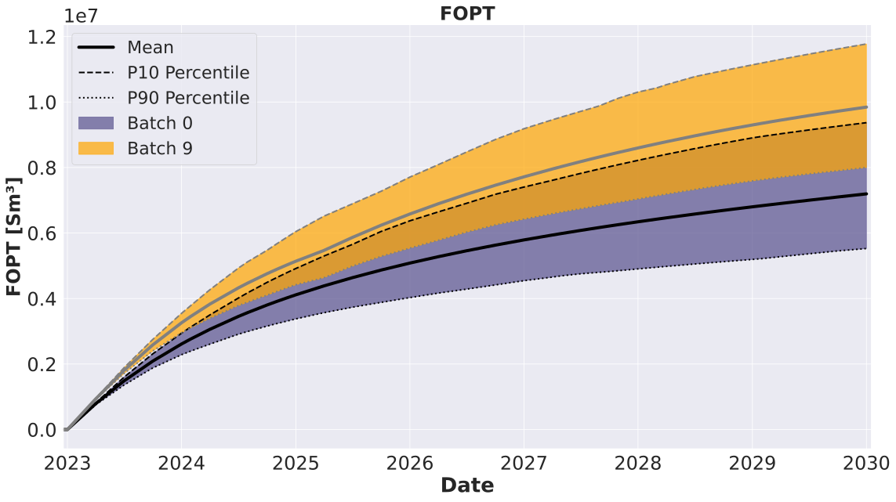

#######################
Well Swapping Optimization
#######################

This tutorial aims to demonstrate how to optimize the dynamic operational schedule of wells by swapping the status to be assigned to each well over time in order to maximize (or minimize) a user-defined objective function. This can be used to determine the schedule of wells alternating between open/closed status (as the example described in this tutorial), but it can also be applied to more general cases with more possible statuses (e.g., conversion of well types producer/injector/shut over time). The well swapping optimization functionality is also based on the priority-based parametrization used for drilling order and well selection optimization, but the approach is extended to multiple sets of priority controls to enable the determination of well statuses at multiple time-intervals throughout the field production life-cycle. Therefore, this tutorial builds upon the knowledge presented in the :doc:`drilling order optimization <well_order>` and :doc:`well selection optimization <well_select>` by adding new complexity to the workflow presented there.

First, we formulate an example optimization problem and we explain the configuration files. Next, we show how to launch an optimization experiment and then we analyze the results:

* :ref:`Define optimization problem <problem_wsw>`

  * :ref:`Optimization variables (controls) <controls_wsw>`
  * :ref:`Objective functions (objectives) <objectives_wsw>`
  * :ref:`Simulation models <simulation_wsw>`

* :ref:`Prepare configuration <configuration_wsw>`

  * :ref:`Main configuration <config_main_wsw>`
  * :ref:`Configuration of forward jobs <configs_forward_jobs_wsw>`
  * :ref:`Simulation schedule template <schedule_wsw>`

* :ref:`Run EVEREST and analyze results <results_wsw>`

.. _problem_wsw:
***************************
Define optimization problem
***************************
We are interested in finding the operational schedule of producers for the Drogon field (alternating between open/closed status) that maximizes a certain objective function over a certain set of geological scenarios and over a certain time period. The field is developed with 6 wells; 4 producers: A1, A2, A3, A4 and 2 injectors A5, A6. For the sake of this particular tutorial, we assume operations to be limited by surface facility constraints, allowing only 3 out of the 4 producers to be put on stream simultaneously, which means that, at all times, one of the producers needs to be set to status closed. In other words, in order to utilize all producers throughout the production life-cycle, their statuses (open/closed) must be smartly scheduled over time. We assume that the status of the producers can be determined over 3 time periods, whose durations may vary, and that the open/closed statuses may be alternated as many times as required. The starting date for planning the swapping schedule of the producers is chosen to be 2023-01-01, considering all 4 producers as eligible to be open from that date onwards. We assume that the status of the wells can be switched instantaneously and that the status switching moment is synchronized.

.. _controls_wo:
Optimization variables
######################

Swapping priority values
************************

In order to determine the status of the wells at each time period, a priority-based parametrization is used to assist in selecting which wells should be switched to a higher hierarchy status (in this case, the open status). This follows the same approach as in :doc:`well selection optimization <well_select>`, where the subset of wells to be selected is determined by the set of priority values of all wells, together with the exact number of wells to be selected. The main difference here is that well swapping optimization entails a dynamic selection of wells over time. Therefore, multiple sets of priority values are needed, i.e. one set of well priorities for each time period.

.. note::
   Another difference with respect to well selection optimization is that some changes in status may not be allowed. This is not applicable to the simple example in this tutorial, but it may be relevant in cases with more possible statuses and irreversible changes in status. In those situations, the logic to select well statuses becomes more involved, requiring the tracking of the history of statuses in order to determine the possible status changes for the subsequent time periods. For information on how to define more complex well swapping constraints, see relevant documentation section `(EVEREST documentation <https://everest.readthedocs.io/en/latest/forward_model_jobs.html#well_swapping-category>`_)

Let's assume, we want to start optimization with the first 3 producers (in alphabethical order) set to be open throughout the three time periods of the production life-cycle, with an even duration of 450 days between the well swapping times. We need to assign 3 well priority values for each well. The higher the priority value within each time period, the higher the chances of the well being among the producers set to be open. In order to give all the wells initially selected to be open (A1, A2, A3) the same probability of being swapped by the well initially chosen to be kept closed (A4), we set equally high priority values for A1, A2 and A3, and a slightly lower priority for A4. See the :ref:`table_initial_controls_wsw` for chosen well priority values. We also need to specify what standard deviation to use when randomizing priorities for perturbations. We recommend setting standard deviation to be slightly larger to the difference between the initial priority values (0.05 for the example in :ref:`table_initial_controls_wsw`).

.. _table_initial_controls_wsw:
.. csv-table:: Table: Initial control values
   :widths: 20, 20, 20, 20, 20, 20, 20
   :align: center

   "Time period","#1","#2","#3"
   "Priority A1","0.53","0.53","0.53"
   "Priority A2","0.53","0.53","0.53"
   "Priority A3","0.53","0.53","0.53"
   "Priority A4","0.5","0.5","0.5"
   "Duration","450","450","450"

The resulting schedule for the initial control values from :ref:`table_initial_controls_wsw` is displayed in :ref:`table_initial_schedule_wsw`.
  
.. _table_initial_schedule_wsw:
.. csv-table:: Table: Initial well status schedule
   :widths: 20, 20, 20, 20, 20, 20, 20
   :align: center

   "Time period","#1","#2","#3"
   "Status A1","open","open","open"
   "Status A2","open","open","open"
   "Status A3","open","open","open"
   "Status A4","closed","closed","closed"
   "Date","2023-01-01","2024-03-26","2025-06-19"

.. _objectives_wo:
Objective functions
###################

Net present value (NPV)
***********************

A single objective function is utilized in this well swapping optimization tutorial. The economic objective function is defined as Net Present Value (NPV) as follows:

.. math::

     J = \sum\limits_{k=1}^{K}\Bigg(\dfrac{\{[(q_{o,k}) \cdot r_{o} + (q_{g,k}) \cdot r_{g} - (q_{wp,k}) \cdot r_{wp}] - [(q_{wi,k}) \cdot r_{wi}]\} \cdot \Delta t_{k} - c_{k}}{(1+b)^{\frac{t_{k}}{\tau_{t}}}}\Bigg)

Where :math:`q_{o,k}` is the oil production rate in :math:`\frac{Sm^3}{day}`, :math:`q_{g,k}` is the gas production rate in :math:`\frac{Sm^3}{day}`, :math:`q_{wp,k}` is the water production rate in :math:`\frac{Sm^3}{day}`, :math:`q_{wi,k}` is the water injection rate in :math:`\frac{Sm^3}{day}`, :math:`r_o` is the price of oil in :math:`\frac{$}{Sm^3}`, :math:`r_{wp}` is the cost of water produced in :math:`\frac{$}{Sm^3}`, :math:`r_{wi}` is the cost of water injected in :math:`\frac{$}{Sm^3}`, :math:`{\Delta}t_k` is the difference between consecutive time steps in days, :math:`c_k` are the CAPEX costs, :math:`b` is the discount factor expressed as a fraction per year, :math:`t_k` is the cumulative time in days corresponding to time step :math:`k`, and :math:`{\tau}_t` is the reference time period for discounting, typically one year (365.24 days). The unit prices for oil production (:math:`r_o`), gas production (:math:`r_g`), water production (:math:`r_{wp}`), and water injection (:math:`r_{wi}`) as well as drilling costs can be defined in :file:`well_swap/everest/input/prices.yml`.

.. note::
   We assume here no costs to be associated with the operations to switch the status of the wells.

.. _simulation_wsw:
Simulation models
#################

Drogon Reservoir Model
**********************

The Equinor Drogon model is a synthetic reservoir model designed for testing and demonstrating ensemble-based workflows, including uncertainty quantification and optimization in subsurface projects. It is publicly available on GitHub to facilitate reproducible research and training.

.. _drogon-figure-init-soil-wsw:
.. figure:: ../model_description/images/DROGON_INIT_SOIL.png
    :align: center
    :alt: model zones
    :figclass: align-center

    Drogon model: Average initial oil saturation across the ensemble.

The model contains four production wells (A1 to A4) and two water injection wells (A5 to A6). In this tutorial, the production and injection starts in September 2022 and is simulated until January 2030. The average oil saturation across the 100 geological realizations for September 2022 is shown in :ref:`drogon-figure-init-soil-wsw`. The production wells A1 to A4 are located within the oil-bearing zone, while the injection wells A5 and A6 are placed below oil-water contact.

.. _configuration_wsw:
*********************
Prepare configuration
*********************

The downloaded material is already complete and ready to be launched, however it is still useful to understand how the defined problem was configured. Information related to initial guess, objective functions and the model needs to be specified in main EVEREST configuration file. After downloading tutorial files from :ref:`download_material` this file will be located at ``well_swap/everest/model/wellswap_experiment.yml``.

.. _config_main_wsw:
Main configuration
##################

The initial guess for EVEREST is located in the section ``controls`` in main configuration file. This is where we insert the initial priority values for each well and time period, and the duration (in days) of each time period:

.. literalinclude:: ../../../data/drogon/well_swap/everest/model/wellswap_experiment.yml
   :language: yaml
   :lines: 19-36

At every iteration EVEREST will randomly perturb the current best priority and duration values and use this information to calculate the direction and step size to propose improved priority and duration values (and therefore improved well swapping schedule) for the next iteration. This means that we need to choose the size of the perturbation, see standard deviation input as ``perturbation_magnitude`` in the ``controls`` section. We also need to choose number of perturbations for each geological realization, see keyword ``perturbation_num`` in ``optimization`` section:

.. literalinclude:: ../../../data/drogon/well_swap/everest/model/wellswap_experiment.yml
   :language: yaml
   :lines: 41,43

We also need to specify the name of the objective function in the ``objective_functions`` section. EVEREST will require a file with that same name to be generated by one of the forward model jobs.

.. literalinclude:: ../../../data/drogon/well_swap/everest/model/wellswap_experiment.yml
   :language: yaml
   :lines: 38-39

.. note::
   Using priority control values (for parametrization of discrete decisions) requires additional attention to the step size of the line search of the back-end optimizer. In this tutorial, because priority controls are combined with continuous duration controls, the following settings of the optpp_q_newton optimizer Dakota back-end (default in EVEREST) are chosen:

   .. literalinclude:: ../../../data/drogon/well_swap/everest/model/wellswap_experiment.yml
      :language: yaml
      :lines: 41,47-48
   
   These settings are case-dependent, well swapping optimization in other cases may require adjusting this ``max_step`` value.

.. _configs_forward_jobs_wsw:
Configuration of forward jobs
#############################

For every set of controls, EVEREST needs to translate those into a well swapping schedule. The well statuses will be inserted in the schedule input file to the reservoir simulator at the appropriate dates (see :ref:`table_initial_schedule_wsw`). This is accomplished by a sequence of forward jobs, i.e.:

.. literalinclude:: ../../../data/drogon/well_swap/everest/model/wellswap_experiment.yml
   :language: yaml
   :lines: 68-71

The ``well_swapping`` job will translate the set of priorities and durations given by EVEREST into a well swapping schedule, i.e. each well will be assigned a date according to operational schedule at which to insert a keyword template. The start date of well swapping and the operational constraints (e.g., allowed number of wells to be assigned to each status, hierarchy of statuses and allowed status changes) needs to be specified in the input file to the well_swapping job, i.e. ``well_swap/everest/input/well_swap_config.yaml``:

.. literalinclude:: ../../../data/drogon/well_swap/everest/input/well_swap_config.yml
   :language: yaml

The ``add_templates`` job will assign a keyword template for each well. In case of well swapping optimization, these templates contain simulator specific keyword to open or close the well:

.. literalinclude:: ../../../data/drogon/well_swap/everest/input/welopen.jinja

.. literalinclude:: ../../../data/drogon/well_swap/everest/input/welshut.jinja

where EVEREST will replace ``{{name}}`` with the name of the well. Finally the ``schmerge`` (schedule merge) forward job will take the input schedule template ``WELLSWAP.SCH`` and insert the ``WELOPEN`` keyword for each well and the correct date. Then it will produce updated schedule file ``SCHEDULE_OPT.SCH`` which will be used by the reservoir simulator. The remaining two forward jobs:

.. literalinclude:: ../../../data/drogon/well_swap/everest/model/wellswap_experiment.yml
   :language: yaml
   :lines: 72-76

are responsible for launching reservoir simulator and calculating NPV. The NPV input file ``well_swap/everest/input/prices.yml`` contains economic input parameters such as unit prices for oil production, water production and injection, drilling costs, discount factor, etc. For more detailed information and examples regarding the forward models please refer to the `EVEREST Documentation <https://everest.readthedocs.io/en/latest/forward_model_jobs.html>`_.

.. _schedule_wsw:
Simulation schedule template
############################

Before the optimization, the schedule file for simulation needs to be adapted. For example, in case of optimization of well swapping, EVEREST will insert ``WELOPEN`` keyword for optimized wells. Therefore, if a different well swapping configuration was defined in the schedule it needs to be removed. At the same time, wells need to have specified well controls in the beginning of the schedule with keywords such as ``WCONPROD`` or ``WCONINJE`` but the optimized wells need to have there ``SHUT`` status. See an example schedule template in downloaded material: ``well_swap/simulator/WELLSWAP.SCH``. The updated schedule file by EVEREST can be seen in the simulation output directory defined in main EVEREST configuration file:

.. literalinclude:: ../../../data/drogon/well_swap/everest/model/wellswap_experiment.yml
   :language: yaml
   :lines: 6-7

Updated schedule files for two different perturbations can be open to see the differences.

.. note::
   In this tutorial case, only the producers are subject to the well swapping optimization. Therefore, only those are set with ``SHUT`` status in the original schedule template ``WELLSWAP.SCH``. The injectors (A5 and A6) are set to ``OPEN`` status.

.. _results_wsw:
Run EVEREST and analyze results
#########################################

After downloading the tutorial files from :ref:`download_material` and the reservoir model realizations from :ref:`drogon_description` we need to point EVEREST to the downloaded model realizations by changing the line:

.. literalinclude:: ../../../data/drogon/well_swap/everest/model/wellswap_experiment.yml
   :language: yaml
   :lines: 1,3

to the correct directory path. 

.. note::
   In addition we might want to change the name of the cluster scheduler. If no cluster support is present, then we can change the line to run all simulations locally, i.e., change ``lsf`` to ``local`` in line:

   .. literalinclude:: ../../../data/drogon/well_swap/everest/model/wellswap_experiment.yml
      :language: yaml
      :lines: 53-55
   
   See also `EVEREST documentation <https://everest.readthedocs.io/en/latest/config_reference.html#>`_.

To launch EVEREST, we can execute the following command from within the directory containing configuration file:

.. code-block:: bash

   everest run wellswap_experiment.yml

.. note::
   The string ``r{{configpath}}`` will be interpreted as the directory path to the configuration file and the string ``r{{realization}}`` will be interpreted as integer number of the geological realization.

.. note::
   For more information on command line interface of EVEREST, type ``everest --help``

.. attention::
   Note that the optimization results may differ when launched on a different machine, Python version or random seed due to random perturbations.  

After the optimization is finished, we can take a look at the output directories defined in ``environment`` section of EVEREST configuration file:

.. literalinclude:: ../../../data/drogon/well_swap/everest/model/wellswap_experiment.yml
   :language: yaml
   :lines: 6-8

In our case we can find optimization results in ``r{{configpath}}/../output/r{{case_name}}/optimization_output`` and reservoir simulation results in ``r{{configpath}}/../output/r{{case_name}}/simulation_output``. The reservoir simulation results will be organized per batch and simulation index. This means that, since we have 100 realizations, the directories which end with ``simulation_0`` to ``simulation_99`` represent current best solution and the remaining directories, i.e., ``simulation_100``, ``simulation_101``, ``simulation_102``, etc. correspond to the randomly perturbed well swapping schedule. The total number of simulations will therefore depend on the choice of the number of perturbations specified in the main configuration file of EVEREST. Here, we selected 1 perturbation for each geological realization; therefore, in total, we should have 200 simulation directories at each iteration.  

.. note::
   Well swapping schedule in batch 0 is the chosen initial well swapping schedule. 

.. note::
   Depending on the choice of ``speculative`` option in ``optimization`` section, the calculations for current best solution and for the gradient might be split in multiple batches, see `EVEREST documentation <https://everest.readthedocs.io/en/latest/config_reference.html#>`_.

The :ref:`figure_objectives_wsw` shows average objective function at the iterations of the optimization experiment (average NPV over all geological realizations). The increase in objective function value of $1.09e+09 was achieved by changing the well swapping schedule from the initial guess. 

.. _figure_objectives_wsw:

   Figure: Objective function over the iterations

.. _figure_priorities_wsw:

   Figure: Initial and optimal well swapping priorities
   
.. _figure_durations_wsw:

   Figure: Initial and optimal swapping time-period durations

The well swapping schedule is defined by a set of priority and duration values. We can compare these values for the initial guess and the optimal solution, see :ref:`figure_priorities_wsw` and :ref:`figure_durations_wsw`. Most notably, the priority values of the producer A4 increased consistently for all the three time periods, setting it to be open throughout the entire production life-cycle, alongside A3. Producer A2 is set to be closed during the first two time-periods and open only at the third time-period, alternating with A1. The durations of the swapping time periods do not seem to vary much, but the duration of the second period is shortened by 100 days. The optimized well status schedule is displayed in :ref:`table_controls_wsw`.

.. _table_controls_wsw:
.. csv-table:: Table: Optimized well status schedule
   :widths: 20, 20, 20, 20, 20, 20, 20
   :align: center

   "Time period","#1","#2","#3"
   "Status A1","open","open","closed"
   "Status A2","closed","closed","open"
   "Status A3","open","open","open"
   "Status A4","open","open","open"
   "Date","2023-01-01","2024-04-29","2025-04-10"

In order to explain the achieved gains in NPV, we can compare production data from the reservoir simulations for initial and optimal solutions. We notice that, by prioritizing A3 and A4 and delaying the production of A2, we achieved increased oil production both at the beginning and at the end of the production life-cycle, see :ref:`figure_fopr_wsw` and :ref:`figure_fopt_wsw`. This was driven by a more effective depletion of the reservoir, see :ref:`figure_fpr_wsw`.

.. _figure_fopr_wsw:

   
   Figure: Field Oil Production Rate

.. _figure_fopt_wsw:

   Figure: Field Oil Production Total

.. _figure_fpr_wsw:

   Figure: Field Average Pressure

With the optimized dynamic well swapping schedule, the cumulative water production was reduced (see :ref:`figure_fwpt_wsw`) while the water injection remained the same (see :ref:`figure_fwit_wo`) when compared to the initial solution, contributing to lower operational costs. This was again beneficial for achieving higher NPV and improving the recovery efficiency.

.. _figure_fwpt_wsw:

   Figure: Field Water Production Total

.. _figure_fwit_wsw:

   Figure: Field Water Injection Total

This concludes the well swapping optimization tutorial. We encourage the reader to check other types of tutorials in the Experiments section.