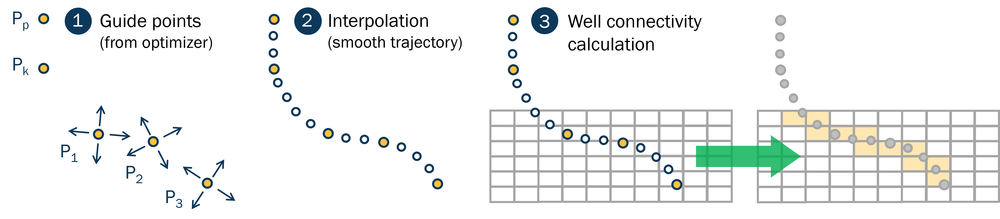
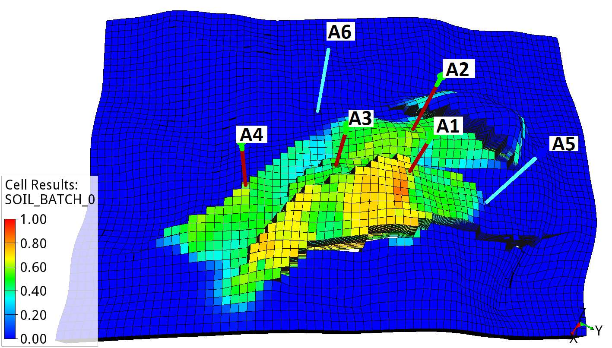

*******************************
Well Trajectory Optimization
*******************************

A primary goal of reservoir management is to maximize reservoir exploitation, typically measured by an economic objective such as Net present value (NPV). A key factor influencing reservoir depletion is the volumetric sweep, which is significantly influenced by the number and spatial pattern of wells within the formation.

This tutorial introduces the EVEREST well trajectory module, which is developed to optimize well trajectories while accounting for geological uncertainties. The tutorial aims to demonstrate how to set up and optimize well trajectories to improve the objective function. The tutorial description is divided into five sections.

1. :ref:`Drogon model description <Drogon_well_trajectory_optimization_case>`
2. :ref:`EVEREST well trajectory workflow <EVEREST_workflow_description>`
3. :ref:`Eclipse input for well path optimization <Eclipse_input>`
4. :ref:`EVEREST input for well path optimization  <EVEREST_input>`
5. :ref:`Optimization experiment results <optimization_results>`

.. _Drogon_well_trajectory_optimization_case:

Drogon model description
=================

The Equinor Drogon model is a synthetic reservoir model designed for testing and demonstrating ensemble-based workflows, including uncertainty quantification and optimization in subsurface projects. The model features a complete Fast Model Update (FMU) setup and is publicly available on GitHub to facilitate reproducible research and training. 

The EVEREST well trajectory optimization case consists of four production wells (A1 to A4) and two water injection wells (A5 to A6). In this tutorial, the production and injection history starts in September 2022 and is simulated until January 2027. The average oil saturation across the 100 geological realizations for September 2022 is shown in Figure 1. The production wells A1 to A4 are located within the oil-bearing zone, while the injection wells A5 and A6 are placed below oil-water contact.

.. _drogon-figure-init-soil:

.. figure:: images/drogon/DROGON_INIT_SOIL.png
    :align: center
    :alt: model zones
    :figclass: align-center

    Drogon model: Average initial oil saturation across the ensemble in September 2022.

More details about the Drogon reservoir model can be found :doc:`here <drogon_description>`. The Drogon EVEREST well trajectory material can be downloaded using the instructions below:

.. admonition:: 1. Download or copy the compressed file containing the tutorial setup to the folder where you want to run the exercise

   .. code-block:: console

    $ cp <path to archive> <destination file>

.. admonition:: 2. Unzip the .zip file

   .. code-block:: console

    $ unzip well_trajectory_optimization.zip

	

Objective function - Optimizing Net present value 
--------------------

A single objective function is utilized in this well trajectory optimization tutorial. The economic objective function is defined as Net present value (NPV) as follows:

.. math::

     J = \sum\limits_{k=1}^{K}\Bigg(\dfrac{\{[(q_{o,k}) \cdot r_{o} + (q_{g,k}) \cdot r_{g} - (q_{wp,k}) \cdot r_{wp}] - [(q_{wi,k}) \cdot r_{wi}]\} \cdot \Delta t_{k} - c_{k}}{(1+b)^{\frac{t_{k}}{\tau_{t}}}}\Bigg)

Where :math:`q_{o,k}` is the oil production rate in :math:`\frac{Sm^3}{day}`, :math:`q_{g,k}` is the gas production rate in :math:`\frac{Sm^3}{day}`, :math:`q_{wp,k}` is the water production rate in :math:`\frac{Sm^3}{day}`, :math:`q_{wi,k}` is the water injection rate in :math:`\frac{Sm^3}{day}`, :math:`r_o` is the price of oil in :math:`\frac{$}{Sm^3}`, :math:`r_{wp}` is the cost of water produced in :math:`\frac{$}{Sm^3}`, :math:`r_{wi}` is the cost of water injected in :math:`\frac{$}{Sm^3}`, :math:`{\Delta}t_k` is the difference between consecutive time steps in days, :math:`c_k` are the CAPEX costs, :math:`b` is the discount factor expressed as a fraction per year, :math:`t_k` is the cumulative time in days corresponding to time step :math:`k`, and :math:`{\tau}_t` is the reference time period for discounting, typically one year (365.24 days).

The unit prices for oil production (:math:`r_o`), gas production (:math:`r_g`), water production (:math:`r_{wp}`), and water injection (:math:`r_{wi}`) are defined in :file:`prices.yml`. Moreover, well drilling costs are accounted for by specifying a drilling costs per kilometer well length. During the optimization workflow, EVEREST extrapolates the well length and calculates the total drilling cost accordingly.

.. code-block:: console

   $ cd everest/input/files/

.. admonition:: Edit the file using the `gedit` editor (or any other editor)

   .. code-block:: console

      $ gedit prices.yml

A snippet of the price input file is displayed below. The following input parameters are specified:

* **prices**:
    * *FOPT, FGPT, FWPT, FWIT*: Specifies the corresponding production or injection quantity.
    * *currency (default)*: USD
    * *date*: Optional — used if discount rates apply.
    * *value*: Defines the prices of the corresponding quantity. Prices must be consistent with the volume unit used in Eclipse, e.g., $/Sm³.

* **well_costs**:
    * *currency (default)*: USD
    * *value*: Drilling cost specified in $/km of well length.
    * *well*: Specifies which well the cost applies to.

.. literalinclude:: ../data/drogon/well_trajectory/everest/input/files/prices.yml
    :language: yml
    :lines: 1-40

.. _EVEREST_workflow_description:

EVEREST well trajectory workflow
=================

.. _well-path-param:
Well path parametrization
--------------------

The EVEREST well trajectory module uses five points per well trajectory to describe well paths. The wellhead or platform location (:math:`P_p`) specifies the starting point of the well, while the kick-off point (:math:`P_k`) defines the depth at which the well begins to deviate from a vertical path.  Points (:math:`P_1`), (:math:`P_2`), and (:math:`P_3`) define the well path within the target formation, for example, the formation entry point, midpoint, and well bottom. In this tutorial, the wellhead (:math:`P_p`) and kick-off point (:math:`P_k`) are assumed to be constant, however, both points can be handled as control variables and optimized. An illustration of the guide points is sketched in Figure 2 below. 

.. _guide_points:

    Well path parametrization using guide points.

To ensure the monotonicity of the well trajectories, points (:math:`P_1`) and (:math:`P_3`) are parameterized independently, while the coordinates of (:math:`P_2`) are defined through a projection between (:math:`P_1`) and (:math:`P_3`). The coordinates of (:math:`P_p`), (:math:`P_k`), (:math:`P_1`), and (:math:`P_3`) are specified in the EVEREST configuration file using the Universal Transverse Mercator (UTM) coordinate system (or others, if suitable), where x,y, and z denote:

- *x*: UTM Easting  horizontal position (east–west) in meters
- *y*: UTM Northing horizontal position (north–south) in meters
- *z*: Depth in meters, typically measured from mean sea level

The corresponding coordinates can be, for example, read from ResInsight after one of the geological realizations has been loaded. Note that EVEREST automatically normalizes the coordinates to ensure that all variables are represented on a comparable scale during the optimization process.

The middle point (:math:`P_2`) = (:math:`P_2`\_a), (:math:`P_2`\_b), (:math:`P_2`\_c) is defined by:

- (:math:`P_2`\_a)  controls the horizontal deviation of the midpoint. A value close to 0 positions the midpoint closer to the start point (:math:`P_1`); a value closer to 1 shifts it toward the end point (:math:`P_3`).

- (:math:`P_2`\_b) determines the curvature of the trajectory between (:math:`P_1`) and (:math:`P_3`). A value of 0 results in a straight-line path. A positive or negative value indicates the direction in which the trajectory bends relative to the baseline.

- (:math:`P_2`\_c) controls the vertical deviation. A value near 0 places the midpoint at the same depth as (:math:`P_3`), while a value near 1 places it at the same depth as (:math:`P_1`).

The default values of (:math:`P_2`\_a), (:math:`P_2`\_b), and (:math:`P_2`\_c) are a = 0.5, b = 0, and c = 0.5, respectively, which yield a straight line between (:math:`P_1`) and (:math:`P_3`). A sketch of the three guide point parametrization is provided in the Figure below.

    Well trajectory three guide point parametrization. The midpoint :math:`P_2`, parameterized by :math:`P_{2a} \in [0, 1]` (horizontal position), :math:`P_{2b} \in [-0.3, 0.3]` (curvature), and :math:`P_{2c} \in [0, 1]` (vertical position), represents a projected point along the path from :math:`P_1` to :math:`P_3`.

After parametrizing the well trajectories with a set of guide points, EVEREST extrapolates the corresponding well paths and writes them in a format readable by the reservoir simulator. During the optimization process, EVEREST moves the guide points within the given coordinate limits and selected perturbation magnitudes. Based on the updated guide points, the well trajectory module extrapolates the well paths and calculates the corresponding well geometry and perforations to be passed to the reservoir simulator. The data is written to the Eclipse/OPM keywords WELSPECS and COMPDAT. To retrieve the required geometrical input, the .EGRID and .INIT files must be present. In the case of multi-segment wells, the well trajectory module can also generate WELSEGS and COMPSEGS keywords.

    EVEREST forward mode: (1) Defining and optimizing guide points, (2) Interpolating well paths, (3) Determining well connectivity in ResInsight, and (4) Passing corresponding keywords to the reservoir simulator.

To determine the grid blocks intersected by the well trajectories, well connections, transmissibilities, and effective Kh factors, EVEREST is coupled to ResInsight. The connection factors are influenced by the geological properties of the intercepted grid block, as well as a geometric correction factor that accounts for the length and position of the well trajectory segment within each intercepted grid block. The geometric factor is derived from projection calculations (see Figure below). Furthermore, EVEREST allows users to specify parameters such as wellbore diameter, skin factor, and D-factor.

    Computing connectivities using ResInsight

To restrict well trajectory perturbations to geologically meaningful areas, the user defines a bounding box using the min and max coordinates in the EVEREST configuration file. The bounding box prevents the optimizer from stepping outside the predefined region, allowing it to focus the search within the target formation. The corresponding bounding box used in the Drogon tutorial is shown in the Figure below. Details on how to define the bounding box are provided in Section :ref:`EVEREST_input`.

.. _bounding_box:

    Drogon model with a bounding box to restrict the optimization process within the target formation or area. 

.. _Eclipse_input:

Eclipse input for well path optimization 
=================

In this tutorial, we will assume that no wells have been added to the Eclipse file yet. To optimize the position of the four Drogon production wells (A1 to A4) and two injection wells (A5 and A6), we initially ensure that the corresponding Eclipse well keywords are added. 

* The forward model prints the general specification data for wells (WELSPECS) and the completion specification data (COMPDAT) into files named *A1.SCH* to *A6.SCH*. Ensure that the Eclipse Schedule section of the simulation file is linked to the output files generated by the forward model.

* Ensure that the WCONPROD section contains an entry for each added production well (A1 to A4). Moreover, the two injection wells are specified in the WCONINJE section.

* Optionally (and not used in this tutorial), in the case of multisegmented wells, the user can add *A1_MSW.SCH* to *A6_MSW.SCH*. These files contain the segmented structure of a multisegmented well (WELSEGS) and the locations of completions within a multisegmented well (COMPSEGS).

A summary of the modified Eclipse *.DATA* file is provided below, which includes the six well schedule files and the corresponding WCONPROD and WCONINJE keywords. 

.. admonition:: Go to

   .. code-block:: console

      $ cd eclipse/model/

.. admonition:: Edit the schedule file using the `gedit` editor (or any other editor)

   .. code-block:: console

      $ gedit DROGON.data

.. literalinclude:: ../data/drogon/well_trajectory/eclipse/model/DROGON.DATA
    :lines:  221-252

.. _EVEREST_input:

EVEREST input for well path optimization
=================

After preparing the EVEREST input files, this section presents the two main well trajectory configuration files in detail. File :file:`drogon_well_trajectory_tutorial.yml` defines the general EVEREST input, including the control variables. File :file:`drogon_trajectory_forward_model.yml` describes the well trajectory forward model input. The EVEREST control section in :file:`file:drogon_well_trajectory_tutorial.yml` defines the coordinates of the four production and two injection wells using three guide points ((:math:`P_1`), (:math:`P_2`), and (:math:`P_3`)). For a three-dimensional case, this results in 54 coordinates that are optimized. The controls section consists of the following keywords:

.. admonition:: Go to

   .. code-block:: console

      $ cd everest/model/

.. admonition:: Edit the schedule file using the `gedit` editor (or any other editor)

   .. code-block:: console

      $ gedit drogon_well_trajectory_tutorial.yml

* **name (default)**: Assigns the x,y,z coordiantes of (:math:`P_1`), (:math:`P_2`), and (:math:`P_3`).
* **type (default)**: Specifies the control type, by default generic_control.
* **perturbation_magnitude**: Lower and upper bounds around the initial guess based on Gaussian (normal) distribution in meters.
* **min, max**: Sets the minimum and maximum value of the corresponding coordinate to restrict the location of the well trajectory perturbations within a specified rectangular bounding box
* **variables**: Control variables defined as follows:
    *  *name*: Name of corresponding well coordinate
    *  *initial_guess*: Initial guess of the corresponding well coordinate.
    *  *enable (default)*: If set to False, the corresponding coordinate will be excluded from the optimization process.

.. literalinclude:: ../data/drogon/well_trajectory/everest/model/drogon_well_trajectory_tutorial.yml
    :language: yaml
    :lines: 23-131

Besides defining the control variables section, the :file:`drogon_well_trajectory_tutorial.yml` specifies the EVEREST forward model section.

* **well_trajectory**: Executes the well trajectory module and writes the updated WELSPECS and COMPDAT data to the Eclipse schedule files 
* **eclipse100**:  Runs the Eclipse or OPM simulator
* **npv**: Calculates the objective function - in this example, the Net present value

.. literalinclude:: ../data/drogon/well_trajectory/everest/model/drogon_well_trajectory_tutorial.yml
    :language: yaml
    :lines: 177-185

After completing the simulation runs and calculating the objective function, EVEREST applies the Stochastic Simplex Approximate Gradient (StoSAG) method to optimize well trajectories toward improved NPV (not shown under **forward _model** snippet above). Following this, EVEREST extrapolates well perturbations around the initial or optimized well coordinates to explore the NPV objective further. The process continues until either the maximum number of batches is reached or a stopping criterion is met.

In addition to the EVEREST main configuration file, :file:`drogon_trajectory_forward_model.yml` defines the well trajectory forward job. The following parameters are specified in the file:

*  **interpolation:**:
	- *type (Predfined)*: resinsight. Type of interpolation to be performed
	- *measured_depth_step*: Resolution of the interpolation. The interpolation will generate points every specified meters apart. Here, every 5 meter.

* **connections:**:
	- *type (Predfined)*: resinsight
	- *date*: Common date for filtering of the perforations. The date should be available in the restart files linked to the realizations.
	- *formation_file*: Specifies the file that defines the geological formations. Can be used to filter for instance the overburden from the well interpolation. 
	- *perforations*: Allows the limitation of perforations to particular formations.

* **wells**:
    - *name*: Well name that must align with the well names in the configure file. 
    - *group*: Well group name printed to WELSPECS
    - *phase*: Phase name printed to WELSPECS
    - *skin*: Skin factor printed to COMPDAT
    - *radius*: Well radius printed to COMPDAT
    - *dogleg*: Measure of well curvature in degrees/30m.
    - *Platform*: Anchor point of (:math:`P_1`), (:math:`P_2`), (:math:`P_3`). 

* **platform:**:
    - *name*: Name of platform
    - *x, y, z*: Platform location in UTM format. Platform (:math:`P_p`) is defined through x, y, and 0. Kickpoint (:math:`P_k`) by x, y, and z. Definition of multiple platforms possible. 

* **NPV input file** Platform and kick location:
    - Link to the NPV price input file

.. admonition:: Go to

   .. code-block:: console

      $ cd everest/input/files/

.. admonition:: Edit the file using the `gedit` editor (or any other editor)

   .. code-block:: console

      $ gedit drogon_trajectory_forward_model.yml

.. literalinclude:: ../data/drogon/well_trajectory/everest/input/files/drogon_trajectory_forward_model.yml
    :language: yml
    :lines: 1-89

.. _optimization_results:

Optimization experiment results 
=================

After introducing and specifying the main EVEREST well trajectory forward model components, we can run the optimization process. Before running the EVEREST run command, it is, however, best practice to execute the EVEREST *lint* command with the same configuration file as an argument to check the validity of the file

.. admonition:: Run the lint test to ensure the syntax of the config file is valid

   .. code-block:: console

      $ everest lint  drogon_well_trajectory_tutorial.yml

If the  *lint* command does not indicate any errors, we can execute the command below to initiate the EVEREST optimization process. 

.. admonition:: Run EVEREST in a unix terminal

   .. code-block:: console

      $ everest run drogon_well_trajectory_tutorial.yml

The results of the optimization process can be visualized using the built-in solution, **Everviz**, or, for example, customized Python analysis tools. To use Everviz, type the following command

.. admonition:: Launch Everviz for the current experiment

   .. code-block:: console

      $ everest results drogon_well_trajectory_tutorial.yml

The Figure below displays the evolution of the objective function (NPV) over eight optimization batches. Starting from an initial NPV of $ 2.68 B, the optimizer rapidly improves the value in the early batch iterations, reaching approximately  $ 3.45 B by batch 5. This corresponds to a total increase of $0.78 billion, representing a 29% improvement over the initial value.

.. _Objective_Function_summary:

    Development the objective function (NPV) over eight optimization batches. The optimizer increases NPV from $2.8 billion to approximately $3.7 billion by batch 5.

The Figures below compare the cumulative production between the initial well configuration (Batch 0) and the optimized well trajectory result (Batch 5). Both cumulative oil production and gas production have increased significantly in Batch 5, with oil production rising by 20% and gas production by 21%. Additionally, water production has decreased by 15%, resulting in reduced operational costs associated with water handling. The combination of higher oil and gas output, along with lower water production, leads to a notable improvement in NPV due to the optimized well trajectories.

.. _Objective_Function_summary:

    Comparison of total field oil production for initial and optimized well trajectory strategies.

    Comparison of total field gas production for initial and optimized well trajectory strategies.

    Comparison of total field water production for initial and optimized well trajectory strategies.

Finally, Figure 11 and Figure 12 display the initial and optimized well trajectories. Production wells A1 and A2 are shifted closer to the crest of the southern structure, which significantly improved hydrocarbon drainage in that area. The positions of wells A3 and A5 were only marginally adjusted, yet the comparison of average oil saturation in December 2027 clearly shows enhanced recovery across the field. Additionally, injection wells A5 and A6 were moved slightly toward the western direction.

    Average oil saturation of the Drogon ensemble for Batch 0 (base case).

    Average oil saturation of the Drogon ensemble for Batch 5 (optimized case).

